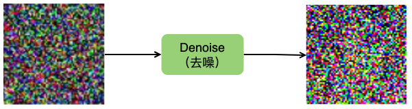
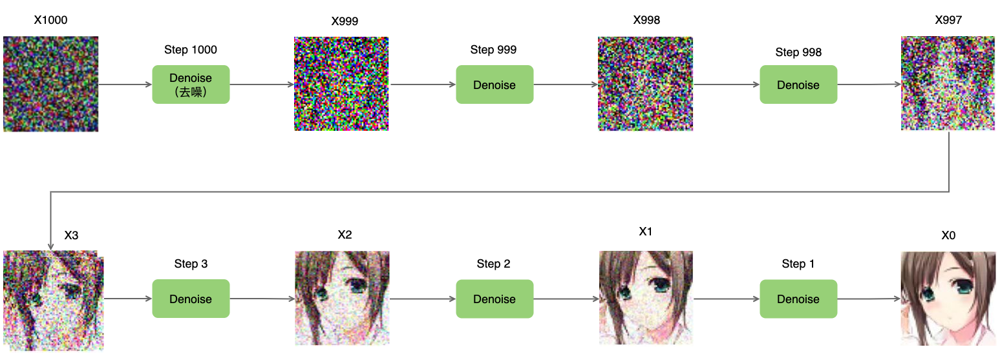

# 如何使用去噪扩散概率模型(DDPM)随机生成动漫头像

去年10月份我组装了一台台式机，当时AI生成图片正直火热，于是我找了一个教程安装了stable diffusion web ui，试了一下效果确实让人震惊，我想很多人都已经了解或者使用过stable diffusion，我想大家可能都会有个疑问，它是如何实现的或者它的原理到底是什么。如果你也对它感兴趣，我作为一个曾经的小白来一点点讲述它是如何实现的。

在了解Stable diffusion的实现原理之前，我们需要先了解概率扩散去噪模型（Denoising Diffusion Probabilistic Models）简称扩散模型（Diffusion Model）。而早在2006年Berkeley大学就已经发表一篇名为Denoising Diffusion Probabilistic Models的论文。

## 扩散模型是如何工作的？

> “雕塑在我开始工作之前，就已经在大理石块中完成了。它已经在那里，我只需要把多余的材料凿掉。” —— 米开朗基罗

扩散模型是如何工作的呢？比如我想通过模型随机生成一个尺寸为64x64x3(RGB)的动漫头像，生成图像的第一步就是随机采样一个服从标准正态分布（高斯分布）噪声的图片。作为一个小白，我想你的第一个问题已经产生了：随机采样一个服从正太分布的噪声是什么意思？你可以暂时将正太分布看做一个黑箱，我们可以从黑箱中随机采样我们想要尺寸大小的噪声图片，如下图：


### 去噪过程(Denoise Process)

噪声图片生成后，会通过一个去噪(Denoise)组件对图片进行去噪，经过去噪的图片相较之前的噪声图片会稍稍变得更像一张正常的图片，如下图：


之后重复此过程，我们假设重复次数为1000次，后面我会说明为什么是1000次，经过1000次去噪后，我们得到了一个尺寸为64x64x3的动漫头像。过程如下图：



可以看到图片的噪声是经过去燥组件一点一点慢慢的去除掉的。实际上去噪的过程中去噪组件需要两个输入：
- 需要去噪的图片
- 步数。例子中是1000到1，至于为啥要把步数作为一个输入和为什么步数是1000我们后面会说明。

所以实际的去噪过程如下图：


现在，我们已经知道想要随机生成一张动漫头像需要对一张噪声图经过1000次去噪来完成。这个过程叫做Denoise Process也叫做Reverse Process，这个过程是不是就如同米开朗基罗说得那样: 雕塑在我开始工作之前，就已经在大理石块中完成了。它已经在那里，我只需要把多余的材料凿掉。在我们的例子中，就好比动漫头像已经存在于噪声图片中了，Denoise过程只是把多余的噪声去掉而已。

那么现在问题的关键就是：这个去噪组件是如何实现的呢？

### 去噪组件

在前面我们已经知道这个去噪组件的输入是
- 需要去噪的图片，用X_T表示
- 步数（例子中是1000到1），用T表示

输出是去噪后的图片。那么它的内部结构或者内部实现是什么样子呢？如下图，去噪组件主要包含两部分：
- 噪声预测器(Noise Predictor)
- 去噪器

当噪声组件接收到输入后，噪声预测器会根据需要去噪的图片X_T和步数T预测出一个噪声，然后去噪器会使用某种方法将预测出的噪声从输入图片X_T中去除，从而得到去噪后的图片X_(T-1)。


那么理解噪声预测器如何工作的就变成了关键。

### 噪声预测器

实际上，噪声预测器是由一个神经网络(Neural Network)训练得来的。噪声预测器的目标就是根据需要去噪的图片X_T和步数T预测出一个噪声。如图所示：


那么噪声预测器是如何训练得来的呢？

我想大部分人虽然没有真正学习过神经网络，但是对训练神经网络有这么一个印象，那就是训练神经网络需要大量的训练数据并且需要对训练数据打标签。在训练神经网络的过程中，对于某个数据D，经过神经网络后会生成预测值，然后会通过这个预测值和实际值(数据D的标签)计算损失值，然后神经网络通过反向传播来不断的调整自己的权重矩阵，从而使得预测值和实际值的损失减小。这其实是一种有监督的学习任务，其过程如下图：


那么对于我们的任务来说，要训练噪声预测器这个神经网络，首先我的要有一个动漫头像的数据集，这个数据集应该包含足够多不同种类的动漫头像。我使用数据集大概包含了两万张如下尺寸为64x64的动漫头像：


其次我们要对图片打标签吗？标签的内容是什么呢？让我们重新回顾一下噪声预测器的目标: 根据需要去噪的图片X_T和步数T预测出一个噪声。是不是发现有什么不对的地方了？噪声预测器的目标是预测噪声，我们如何给图片打噪声的标签呢？要回答这个问题我们首先要了解DDPM的扩散过程。

### 扩散过程(Diffusion Process)

扩散过程又叫前向过程(Forward Process)，它和去噪过程(Denoise Process)正好相反。如下图所示，首先我们从训练的数据集中Sample一张原图x_0，然后对x_0加噪，添加的噪声通过随机采样自正太分布。我知道你肯定在想为啥又是正太分布啊？不急，咱们先把这个问题搁置一下。添加噪声后得到加噪后的图片x_1，然后将x_1作为下个步骤的输入，然后重复这个过程1000次，经过1000次加噪后得到了充满噪声的图片x_1000。


那么这个过程到底有啥用呢？好好的为啥要给图片加噪声呢？

其实这个过程是为了训练噪声预测器这个神经网络准备。让我们回到从x_0加噪至x_1的过程中。过程如下图所示，在这个过程中：
- 首先，通过采样正太分布得到了随机噪声eps_1
- 然后，对x_0加噪eps_1后得到了x_1
- 然后，将x_1和当前的步数1作为神经网络的输入，得到神经网络的噪声预测值pre_eps_1。
- 然后，通过真实的eps_1和预测的pre_eps_1来计算损失
- 然后，神经网络通过反向传播来调整自己的权重矩阵，从而使得后面的预测值和真实值的损失变小。


重复这个过程1000次，这个时候整张图片已经充满的噪声。如下图所示：


在整个过程中，每步中随机采样自正太分布的噪声成为每步中数据的“标签”，一张训练数据图片完成1000次不断的加噪和预测来训练神经网络(噪声预测器)，当噪声预测器训练完毕后，就可以在去噪过程(Denoise process)中使用噪声预测器来预测需要去除的噪音，如图：


至于为什么要在训练神经网络的过程中加入步数T，这是因为在不同的步数中我们所训练的是同一个神经网络，而在不同的步数中所加入的噪声比例是有些区别的，所以我们需要告诉神经网络步数信息。

### 闭环

至此扩散过程和去噪过程已经闭环了，我们再来回顾一下这个过程：
- 首先，需要利用扩散过程(Diffusion Process)来训练噪声预测器，噪声预测器一旦训练完之后，就可以拿来一直使用。
- 然后，在去噪过程(Denoise Process)中通过噪声预测器来预测每一步的噪声，经过1000步去噪音后得到了一张全新的干净的图片。

到此为止，我想你对扩散模型大方向上是如何工作的已经有了一个基本的认识了。但是我猜你可能会有如下的一些问题：
- 噪声为何要采样自正太分布？啥是正太分布？
- 在加噪过程中，噪声是如何被加入到图像中的？
- 在去噪过程中，噪声是如何从图像中去除的？
- 为啥是T是1000步？
- 噪声预测器的神经网络结构是什么样子的呢？如何构建这样的神经网络？以及它为何能够预测噪声？
- 这一切都是魔法吗？

要回答这些问题就得回到《Denoising Diffusion Probabilistic Models》这篇论文中。

## 扩散模型数学原理

在《Denoising Diffusion Probabilistic Models》这篇论文中，对于扩散和去噪过程有如下的定义：


这些公式看起来很复杂，实际也很复杂，但是理解这些公式却是理解DDPM原理的核心所在。

### 训练(Training)

我们可以将DDPM的Training对应到扩散过程(Diffusion Process)。在扩散过程中噪声是如何一点点扩散的呢？可以使用如下数学公式来表达：

$$\sqrt{\beta}\times\epsilon + \sqrt{1-\beta} \times x$$

公式中的
- $\epsilon$ 是通过采样正太分布得到了随机噪声eps
- $x$ 代表输入的图片
- $\beta$ 是一个介于0到1之间的数字，用做 $\epsilon$ 和 $\beta$ 的系数

在训练的过程中 $\beta$ 会由小到大逐渐变化，那么
- $\sqrt{\beta}\times\epsilon$ 的比例就会逐步变大，代表噪声占比越来越大。
- $\sqrt{1-\beta} \times x$ 的比例就会越来越小，代表输入图片占比越来越小。

还记得之前步数T吗？在之前的例子中，我们将T设为1000，那么 $\beta$ 就会变成一个长度为1000的数组，数组中的值在0到1之间逐渐增大，如下面这个数组：
```
[
    0.0001564962795991276,
    0.0002104677074292738,
    0.00026444758275567803,
    0.00031843882130155876,
    ...
    0.7499932543469323
    ...
    0.9999
]
```

数组中的值如何分布，是通过不同的算法的决定的，但是无论如何，当T固定时，我们可以认为 $\beta$ 就是一个提前设置好的已知的数组。至于T为啥是1000呢？它就是一个经验值，其实它可以不是1000，你完全可以设置其它值。但是这个值不能设置的太小了，设置的太小步数就会减少，那么模型需要学习的难度就会变大。这个值也不能太大，太大了，步数变得很多相应的训练时间可能就会变长，最终的结果可能也提升不了多少。

通过引入T后，我们可以重新表达之前的公式为：

$$x_t = \sqrt{\beta}_t\times\epsilon + \sqrt{1-\beta}_t \times x_{t-1}$$

其中 $x_0$ 为训练时使用的干净的原图。

现在我们先主要关注第五行的公式：

$$\nabla_\theta ||\epsilon - \epsilon_\theta(\sqrt{\overline{a}_t}x_0 + \sqrt{1-\overline{a}_t}\epsilon, t)||^2$$

公式中的
$$\epsilon_\theta(\sqrt{\overline{a}_t}x_0 + \sqrt{1-\overline{a}_t}\epsilon, t)$$

表示的是噪声预测器
- 第一个参数 $\sqrt{\overline{a}_t}x_0 + \sqrt{1-\overline{a}_t}\epsilon$ 代表加噪后的图片 $x_t$，所以 $x_t=\sqrt{\overline{a}_t}x_0 + \sqrt{1-\overline{a}_t}\epsilon$
- 第二个参数 $t$就是步数。

如下图所示：


而公式中：
$$||\epsilon - \epsilon_\theta(\sqrt{\overline{a}}x_0 + \sqrt{1-\overline{a}_t}\epsilon, t)||^2$$

表示模型估计的噪声 $\epsilon_\theta(\sqrt{\overline{a}_t}x_0 + \sqrt{1-\overline{a}_t}\epsilon, t)$ 和实际噪声 $\epsilon$ 之间的均方误差（MSE)，如下图:


整个公式:

$$\nabla_\theta ||\epsilon - \epsilon_\theta(\sqrt{\overline{a}_t}x_0 + \sqrt{1-\overline{a}_t}\epsilon, t)||^2$$

表示是神经网络在反向传播中通过梯度下降算法更新模型参数 $\theta$，以使得模型估计的噪声 $\epsilon_\theta$ 更加接近实际噪声 $\theta$。这通过最小化噪声估计的误差来实现，从而提高模型在去噪过程中的表现。

但是公式中的 $\overline{a}_t$是什么？


