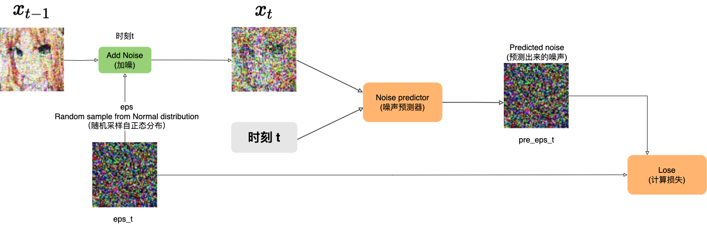

# 如何使用去噪扩散概率模型(DDPM)随机生成动漫头像

我想很多人都已经了解或者使用过stable diffusion，我想大家可能都会有个疑问，它是如何实现的或者它的原理到底是什么。如果你也对它感兴趣，我作为一个曾经的小白来一点点讲述它是如何实现的。

在了解Stable diffusion的实现原理之前，我们需要先了解概率扩散去噪模型（Denoising Diffusion Probabilistic Models）简称扩散模型（Diffusion Model）。而早在2006年Berkeley大学就已经发表一篇名为Denoising Diffusion Probabilistic Models的论文。

## 扩散模型是如何工作的？

> “雕塑在我开始工作之前，就已经在大理石块中完成了。它已经在那里，我只需要把多余的材料凿掉。” —— 米开朗基罗

扩散模型是如何工作的呢？比如我想通过模型随机生成一个尺寸为64x64的RGB动漫头像，扩散模型是如何来完成这样一个任务的呢？在正式回答这个问题之前，我们需要先了解一些关于图像的基本知识。

### RGB图像

我们常见的图像是具有三个通道(RGB)的彩色图，如下图所示：


我们可以使用矩阵来表达任意一张RGB图像。下图是一张16x16x3的图像，3代表RGB三个通道：


### 高斯噪声

DDPM中，生成图像的第一步就是随机采样一个服从标准正态分布（正态分布也叫高斯分布）的噪声，这个噪声叫做高斯噪声，生成的高斯噪声的大小和模型生成图片大小一致，我们可以把这个高斯噪声看作为一个高斯噪声图片。如下图所示，从标准正态分布中随机采样了一个大小为16x16x3的噪声图。


如果你也是一个小白，我想你的第一个问题已经产生了：随机采样一个服从标准正太分布的噪声是什么意思？我们可以暂时将标准正太分布看做一个黑箱，我们可以从黑箱中随机采样服从标准正态分布的噪声图片。


### 去噪过程(Denoise Process)

假设我们从标准正态分布中采样得到一张64x64x3的噪声图，在DDPM中噪声图片生成后会通过一个去噪(Denoise)组件对图片进行去噪，经过去噪的图片相较之前的噪声图片会稍稍变得更像一张正常的图片，之后重复此过程，假设重复次数为1000次（后面我会说明为什么是1000次），经过1000次去噪后，就得到了一个尺寸为64x64x3的动漫头像。过程如下图：


可以看到图片的噪声是经过去噪组件一点一点慢慢的去除掉的。实际上去噪的过程中去噪组件需要两个输入：
- 需要去噪的图片
- 步数。例子中是1000到1，至于为啥要把步数作为一个输入和为什么步数是1000我们后面会说明。

所以实际的去噪过程如下图：


现在，我们已经知道想要随机生成一张动漫头像需要对一张噪声图经过1000次去噪来完成。这个过程叫做Denoise Process也叫做Reverse Process，这个过程是不是就如同米开朗基罗说得那样: 雕塑在我开始工作之前，就已经在大理石块中完成了。它已经在那里，我只需要把多余的材料凿掉。在我们的例子中，就好比动漫头像已经存在于噪声图片中了，Denoise过程只是把多余的噪声去掉而已。

那么现在问题的关键就是：这个去噪组件是如何实现的呢？

### 去噪组件

在前面我们已经知道这个去噪组件的输入是
- 需要去噪的图片，用 $X_T$ 表示
- 步数（例子中是1000到1），用T表示

输出是去噪后的图片。那么它的内部结构或者内部实现是什么样子呢？如下图，去噪组件主要包含两部分：
- 噪声预测器(Noise Predictor)
- 去噪器

当噪声组件接收到输入后，噪声预测器会根据需要去噪的图片 $X_T$ 和步数T预测出一个噪声，然后去噪器会使用某种方法将预测出的噪声从输入图片 $X_T$ 中去除，从而得到去噪后的图片 $X_{T-1}$ 。


那么理解噪声预测器如何工作的就变成了关键。

### 噪声预测器

实际上，噪声预测器是由一个神经网络(Neural Network)训练得来的。噪声预测器的目标就是根据需要去噪的图片 $X_T$ 和步数 $T$ 预测出一个噪声。如图所示：


那么噪声预测器是如何训练得来的呢？很多人虽然没有真正学习过神经网络，但是对训练神经网络有这么一个印象，那就是训练神经网络需要大量的训练数据并且需要对训练数据打标签。

在训练神经网络的过程中，对于某个数据集D，经过神经网络后会生成预测值，然后会通过这个预测值和实际值(数据D的标签)计算损失值，然后神经网络通过反向传播来不断的调整自己的权重矩阵，从而使得预测值和实际值的损失减小。其过程如下图：


那么对于我们的任务来说，要训练噪声预测器这个神经网络，首先我的要有一个动漫头像的数据集，这个数据集应该包含足够多不同种类的动漫头像。这里使用的数据集大概包含了两万张如下尺寸为64x64的动漫头像：


其次我们要对图片打标签吗？标签的内容是什么呢？让我们重新回顾一下噪声预测器的目标: 根据需要去噪的图片 $X_T$ 和步数 $T$ 预测出一个噪声。

是不是发现有什么不对的地方了？噪声预测器的目标是预测噪声，我们如何给图片打噪声的标签呢？要回答这个问题我们首先要了解DDPM的扩散过程。

### 扩散过程(Diffusion Process)

扩散过程又叫前向过程(Forward Process)，它和去噪过程(Denoise Process)正好相反。如下图所示，首先我们从训练的数据集中Sample一张原图 $x_0$ ，然后对 $x_0$ 加噪，添加的噪声是随机采样自正太分布。添加噪声后得到加噪后的图片 $x_1$ ，然后将 $x_1$ 作为下个步骤的输入，然后重复这个过程1000次，经过1000次加噪后得到了充满噪声的图片x_1000。


那么这个过程到底有啥用呢？好好的为啥要给图片加噪声呢？

其实这个过程是为了训练噪声预测器这个神经网络。让我们回到从 $x_0$ 加噪至 $x_1$ 的过程中。过程如下图所示，在这个过程中：
- 首先，通过采样标准正太分布得到了随机噪声eps_1
- 然后，对 $x_0$ 加噪eps_1后得到了 $x_1$
- 然后，将 $x_1$ 和当前的步数1作为神经网络的输入，得到神经网络的噪声预测值pre_eps_1。
- 然后，通过真实的eps_1和预测的pre_eps_1来计算损失
- 然后，神经网络通过反向传播来调整自己的权重矩阵，从而使得后面的预测值和真实值的损失变小。


重复这个过程1000次，最终整张图片充满的噪声。如下图所示：



在整个过程中，**每步中随机采样自正太分布的噪声成为每步中数据的“标签”，一张训练数据图片完成1000次不断的加噪和预测来训练神经网络(噪声预测器)**。当噪声预测器训练完毕后，就可以在去噪过程(Denoise process)中使用噪声预测器来预测需要去除的噪音。至于为什么要在训练神经网络的过程中加入步数T，这是因为在不同的步数中我们所训练的是同一个神经网络，而在不同的步数中所加入的噪声比例是有些区别的，所以我们需要告诉神经网络步数信息。

### 小结

现在我们再来回顾一下这个过程：
- 首先，需要利用扩散过程(Diffusion Process)来训练噪声预测器，噪声预测器一旦训练完之后，就可以拿来一直使用。
- 然后，在去噪过程(Denoise Process)中通过噪声预测器来预测每一步的噪声，经过1000步去噪音后得到了一张全新的干净的图片。

这个过程如下图所示：


到此为止，我想你对扩散模型大方向上是如何工作的已经有了一个基本的认识了。但是我猜你可能会有如下的一些问题：
- 噪声为何要采样自正太分布？啥是正太分布？
- 在加噪过程中，噪声是如何被加入到图像中的？
- 在去噪过程中，噪声是如何从图像中去除的？
- 为啥是T是1000步？
- 噪声预测器的神经网络结构是什么样子的呢？如何构建这样的神经网络？以及它为何能够预测噪声？
- 这一切都是魔法吗？

要回答这些问题就得回到《Denoising Diffusion Probabilistic Models》这篇论文中。但在此之间我们需要学习一些关于正态分布的知识。

## 正态分布

在前面我们暂时将标准正太分布看做一个黑箱，我们可以从黑箱中随机采样我们想要尺寸大小的噪声图片。那么什么是正态分？

正态分布，也称为高斯分布或钟形曲线，是一种常见的概率分布。在统计学中，它用于描述数据的分布情况。标准正态分布是正态分布的一个特例，下图是一个标准正态分布图，其均值为0，标准差为1，黄色区域为一个标准差范围:


正态分布的主要特点有：

- 对称性
    - 正态分布的曲线是对称的，中心点位于均值（平均值）处。
    - 这意味着数据在均值两侧的分布是一样的。
- 钟形曲线
    - 曲线形状像一个钟，左右两边逐渐下降，中间最高。
    - 大部分数据集中在均值附近，越远离均值的值出现的概率越小。
- 均值和标准差
    - 均值（μ）：分布的中心点，表示数据的平均值。
    - 标准差（σ）：衡量数据的分散程度。标准差越大，曲线越宽；标准差越小，曲线越窄。
- 68-95-99.7规则
    - 68% 的数据在均值的一个标准差范围内。
    - 95% 的数据在均值的两个标准差范围内。
    - 99.7% 的数据在均值的三个标准差范围内。    

正态分布的概率密度函数(PDF)定义为：

$$f(x) = \frac{1}{\sqrt{2\pi\sigma}}e^{[-\frac{x-\mu^2}{2\sigma^2}]}$$

从正态分布的概率密度函数表达式中可以知道，只有 $\mu$ 和 $\sigma$ 是未知参数，所以通过 $\mu$ 和 $\sigma$ 可以确定一个正态分布，我们可以使用如下的表达式来表达一个正态分布，其中N代表正态分布(Normal distribution):

$$N(\mu, \sigma^2)$$

标准正太分布的均值 $\mu = 0$，标准差 $\sigma = 1$ ，所以可以表示为：

$$N(0, 1)$$

在我们的例子中，我们采样出来高斯噪声是多维的，它是采样自多维标准正态分布，那么可以使用如下表达式来表达：
$$N(0, I)$$

### 正态分布的特性

在DDPM中选择使用正态分布的原因是因为正态分布有很多特性能够使得模型的训练和推理更简单和高效。这里我只列出几个我们后面需要用到的特性：

#### 闭合性
多个正态分布的线性组合仍然是正态分布。可以表示为:

$$N_1(\mu_1, \sigma_1^2) + N_2(\mu_2, \sigma_2^2)= N_3(\mu_1 + \mu_2, \sigma_1^2 + \sigma_2^2)$$

#### 重参数化技巧

假设我们有一个正态分布，均值为 $\mu$ ，标准差为 $\sigma$ ，通常情况下我们需要通过采样 $z \thicksim N(\mu, \sigma^2)$ 来生成随机变量 $z$ 。使用重参数化技巧，我们通过引入一个标准正态分布的随机变量 $\epsilon \thicksim N(0, 1)$ ，然后用它来生成所需的随机变量 $z = \mu + \sigma\cdot\epsilon$


## 扩散模型原理

在《Denoising Diffusion Probabilistic Models》这篇论文中，对于扩散和去噪过程有如下的定义：


这些公式看起来很复杂，实际也很复杂，但是理解这些公式却是理解DDPM原理的核心所在。

### 训练阶段(Training)

我们可以将DDPM的Training对应到扩散过程(Diffusion Process)。在扩散过程中噪声是如何一点点扩散的呢？或者说噪声是如何一点点被加进来的呢？让我们再来回顾一下之前的加噪过程，如下图所示：


当加噪器添加噪声的时候，它是按照如下的数学公式定义来添加噪声的：

$$\sqrt{\beta}\times\epsilon + \sqrt{1-\beta} \times x$$

公式中的
- $\epsilon$ 是通过采样标准正太分布得到了随机噪声eps
- $x$ 代表输入的图片
- $\beta$ 是一个介于0到1之间的数字，用做 $\epsilon$ 和 $\beta$ 的系数

在训练的过程中 $\beta$ 会由小到大逐渐变化，那么
- $\sqrt{\beta}\times\epsilon$ 的比例就会逐步变大，代表噪声占比越来越大。
- $\sqrt{1-\beta} \times x$ 的比例就会越来越小，代表输入图片占比越来越小。

<!-- 仔细观察噪声图的系数 $\sqrt{\beta}$ 和原图 $x$ 的系数，你会发现它们之间的关系满足勾股定理，即：

$$(\sqrt{\beta})^2 + (\sqrt{1-\beta})^2 = 1$$

至于这么做有什么特殊意义 -->

还记得之前步数 $T$ 吗？在之前的例子中，我们将 $T$ 设为1000，那么 $\beta$ 就会变成一个长度为1000的数组，数组中的值在0到1之间逐渐增大，如下面这个数组：
```
[
    0.0001564962795991276,
    0.0002104677074292738,
    0.0002644475827556783,
    0.0003184388213015587,
    ...
    0.7499932543469323234
    ...
    0.9999999999999999999
]
```

数组中的值如何分布，是通过不同的算法的决定的，但是无论如何，当 $T$ 固定时，我们可以认为 $\beta$ 就是一个提前设置好的已知的数组。至于 $T$ 为啥是1000呢？它就是一个经验值，其实它可以不是1000，你完全可以设置其它值。但是这个值不能设置的太小了，设置的太小步数就会减少，那么模型需要学习的难度就会变大。这个值也不能太大，太大了，步数变得很多相应的训练时间可能就会变长，最终的结果可能也提升不了多少。

通过引入 $T$ 后，我们可以重新表达之前的公式为：

$$x_t = \sqrt{\beta_t} \times \epsilon + \sqrt{1-\beta_t} \times x_{t-1}$$

其中 $x_0$ 为训练时使用的干净的原图。

为了简化后面的公式，现在我们引入一个新的变量 $\alpha$ , 并令 $\alpha = 1 - \beta$ ，那么，我们又可以重新表达之前的公式为：

$$x_t = \sqrt{1 - \alpha_t} \times \epsilon + \sqrt{\alpha_t} \times x_{t-1}$$

经过一些列复杂推导，得到：


<!-- $$x_t=\sqrt{\overline{\alpha}_t}x_0 + \sqrt{1-\overline{\alpha}_t}\epsilon$$ -->

其中 

$$\overline{\alpha_t} = \alpha_1 \times \alpha_2 \times ... \times \alpha_{t-1} \times \alpha_t $$ 

由于 $\beta$ 是已知的，所以任意时刻的 $\overline{\alpha_t}$ 也是已知的。这个公式得到了一个比较重要的结论就是：**对于任意 $x_t$ 可以由原图 $x_0$ 直接生成**。如下图所示：


现在我们已经可以通过 $x_0$ 生成任意时刻的加噪图 $x_t$，那么我们就可以将 $x_t$ 和t作为训练噪声预测器的输入，这里我们使用 $\epsilon_\theta$ 来表示噪声预测器, $\theta$ 表示神经网络的权重参数。那么我可以使用如下公式来表达训练噪声预测器：

$$\epsilon_\theta(\sqrt{\overline{a}_t}x_0 + \sqrt{1-\overline{a}_t}\epsilon, t)$$

通过 $\epsilon_\theta$ 之后我们就得到了预测噪声。然后，使用如下公式来计算真实噪声和预测噪声的均方误差(MSE)：

$$||\epsilon - \epsilon_\theta(\sqrt{\overline{a}}x_0 + \sqrt{1-\overline{a}_t}\epsilon, t)||^2$$

其过程如下图所示：


而如下公式表示是神经网络在反向传播中通过梯度下降算法更新模型参数 $\theta$，以使得模型估计的噪声 $\epsilon_\theta$ 更加接近实际噪声 $\theta$。

$$\nabla_\theta ||\epsilon - \epsilon_\theta(\sqrt{\overline{a}_t}x_0 + \sqrt{1-\overline{a}_t}\epsilon, t)||^2$$

### 采样阶段(Sampling)

我们可以将DDPM的Sampling对应到去噪过程(Denoise Process)，去噪过程如下图所示：


在去噪过程中，首先我们需要随机采样一个服从正太分布的噪声 $x_T$，使用公式 $x_T \sim N(0, I)$ 来表达。之后使用噪声预测器来预测噪声，使用公式 $\epsilon_\theta(x_t, t)$ 来表达。最后通过如下公式来计算 $x_{t-1}$ :


<!-- $$x_{t-1} = \frac{1}{\sqrt{\alpha_t}}(x_t - \frac{1 - \alpha_t}{\sqrt{1 - \overline{\alpha_t}}}\epsilon_\theta(x_t, t)) + \sigma_t z$$ -->

这个公式是如何推导出来的我们后面再说，其中 $z$ 采样自标准正太分布：
$$z \sim N(0,I)$$

而 $\sigma_t$ 定义如下：
$$\sigma_t = \sqrt{\frac{(1 - \alpha_t)(1 -  \overline{\alpha}_{t - 1})}{ 1 - \overline{\alpha}_t}}$$

所以，我们可以将其表示为：


在我们之前的例子中，我们将 $T$ 设为1000，那么去噪过程的第一步就是在标准正态分布中采样高斯噪声 $x_{1000} \sim N(0, I)$ ，之后通过 $x_{t-1}$ 的公式一步步去除由噪声预测器 $\epsilon_\theta$ 预测出的噪声，最终生成 $x_0$ 。

### 小结

到此为止，我想你对于扩散模型是如何运行的有了更细节的了解。


其中画线的几个问题应该也得到了解答：
- 噪声为何要采样自正太分布？啥是正太分布？
- ~~在加噪过程中，噪声是如何被加入到图像中的？~~
- ~~在去噪过程中，噪声是如何从图像中去除的？~~
- ~~为啥是T是1000步？~~
- 噪声预测器的神经网络结构是什么样子的呢？如何构建这样的神经网络？以及它为何能够预测噪声？
- 这一切都是魔法吗？

与此同时，也可能又新增了几个问题，比如：
- Training和Sampling中的加噪和去噪公式是如何推导出来的？

但是围绕在我心头最难以理解的是：为啥非要通过多步加噪来训练模型，然后又通过多步去噪来生成图片？这一切的本质到底是什么？最初的想法到底是源于什么？

## 扩散模型的本质

想象一下有这么一个神秘的箱子，我们可以从箱子中抽取出一张张的图片，那么这个箱子中的抽取出来的图片遵循的概率分布是什么样的？

// 图片: 神秘抽奖箱子

首先来看一下最简单的情况，假设从箱子中抽取出的图片是只有两个像素的灰度图片。如下图所示只有左右两个像素的图片：


既然是灰度图，那么它的像素值取值范围就只能在[0, 255]之间，我们将其映射到[-1, 1]之间，-1表示黑色，1表示白色。


然后，使用x轴表示左边的像素值，使用y轴表示右边的像素值。


那么，图中蓝色区域内的任意一点代表一张两像素的灰度图，换而言之，蓝色区域包含了两像素灰度图所有可能的像素颜色组合。


接着，用z轴的位置表示对应图片从抽奖箱中采样出来的概率密度


这样，平面就变成了曲面，曲面和xy平面之间合围的体积表示概率


或者简单来说，某点隆起的高度越高，其对应的图片有更高的概率从抽奖箱中抽出，而对于那么毫无意义的像素组合，它们的高度为0，不可能从抽奖箱中采样得出。这就是两像素灰度图的概率空间。


如果确定左边像素的颜色值，比如x=-0.3，那么就得到了和x=-0.3平面相交的一条曲线。


该曲线就是条件概率 $P(Y|X=0.3)$ 的概率密度函数曲线，也就是在左像素颜色值为-0.3的情况下右像素的颜色概率分布。


同样的，如果确定了右像素的颜色值，比如0.1，那么就得到了和y=0.1平面相交的一条曲线。


该曲线就是条件概率 $P(X|Y=0.1)$ 的概率密度函数曲线。也就是在右像素颜色值为0.1的情况下左像素的颜色概率分布。


我们也可以用画等高线的方式给概率空间上色，其中越接近红色概率越高。这就是两像素灰度图的概率空间，可以用二维的热度图表示。


两像素灰度能传递的信息太少，那么对于一张64x64RGB彩色图片，它的概率空间是什么样子的呢？彩色图片每个像素由RGB三个通道表示，也就是每个像素需要3个维度表示，64x64的RGB彩色图片一共有4096个像素，那么其对应的概率空间维度总数不少于12288维。那是难以想象的高维空间。但是我们可以通过两像素灰度图的低维概率空间去理解高维概率空间的一些性质：
- 首先高维概率空间涵盖了所有可能的像素颜色组合。
- 其中的任意一点对应一种组合方式。
- 如果某个图像中的某个像素颜色不确定，通过周围其它像素颜色对该图像颜色进行推测时，实际上是高维概率空间中在其它维度数值确定后得到的一个超截面，表示该像素点颜色的条件概率。
- 如果某种像素组合是毫无意义图片，则其相应的概率值为0.

当从神奇抽奖箱中抽取出一张图片时，实际上是从高维概率空间采样得到其中的一个点，这样的概率空间也称为数据的真实分布。如果我们能通过神经网络拟合出数据的真实分布，就可以随机的生成图片，但是要这么做会有两个挑战：
- 复杂：真实的数据分布一定是极其复杂的
- 未知：地球上没有人知道数据的真实分布是什么

简而言之，真实的数据分布是复杂且未知的分布。那么DDPM中是如何解决这两个问题的呢？

### 复杂

先思考这样一个问题，假设抽奖箱中有十个球，这些球的颜色要么是黑色，要么是白色。


在抽奖前我们可以控制箱子中球的颜色，比如3个黑球和7和白球。


这样从抽奖箱中随机抽取一个球，有30%的概率得到黑球，或者70%的概率得到白球。也就是说，抽奖前我们通过控制10个球的颜色，来决定随后采样得到小球颜色的概率。


那么我们应该如何控制这10个球的颜色来是得抽奖箱采样得到黑球和白球的概率分别为54%和46%呢？


如果箱子中能够放入27个黑球和23个白球，当然可以实现54%和46%的概率分布，但那需要50个球，而箱子中仅有10个球。对于这个问题我们可以这样做：

- 首先在箱子中放入4个黑球和6个白球，然后在箱子中随机抽取一个球。
- 如果得到的是黑球，则调整箱子为3个黑球和7个白球
- 如果得到的是白球，则调整箱子为7个黑球和3个白球

就这样根据第一次抽奖的结果调整抽奖箱中十个球的颜色，然后进行第二次抽取。我们用一张表格列举出所有的四种情况。
- 两次都抽取到黑球的概率为：40%x30%=12%
- 先抽取到黑球再抽取到白球的概率为：40%x70%=28%
- 两次都抽取到白球的概率为：60%x30%=18%
- 先抽取到白球再抽取到黑球的概率为：60%x70%=42%

那么：
- 第二次抽奖得到黑球的概率(边缘概率)为12%+42%=54%
- 第二次抽奖得到白球的概率(边缘概率)为28%+18%=46%


如果，我们将问题换一下：如何通过控制箱子中10个球的颜色来使得抽奖箱采样得到黑球和白球的概率分别为15.4%和84.6%呢？

我们可以根据第二次抽取得到的小球颜色来设置第三次抽奖箱中十个球的概率。
- 如果第二次抽取到了黑球，则第三次抽奖箱中放入2个黑球和8个白球
- 如果第二次抽取到了白球，则第三次抽奖箱中放入1个黑球和9个白球

那么：
- 第三次抽取到黑球的边缘概率为：10.8%+4.6% = 15.4%
- 第三次抽取到白球的边缘概率为：43.2%+41.4% = 84.6%


从这个例子中可以看到：

- 第二次抽奖得到小球颜色的边缘概率实际上等同于从27个黑球和23白球的抽奖箱中抽取的概率。


- 第三次抽奖得到小球的边缘概率实际上等同于从77个黑球和423个白球的抽奖箱中抽取的概率。


黄色抽奖箱中只有十个小球，而红色抽奖箱中的小球数量更多。也就是说，黄色抽奖箱中的概率只需要使用少数几个变量表达，也就更简单。而描述红色抽奖箱中的概率分布需要用到更多的变量表达，相较而言也就更复杂。而随着抽奖次数越多，表达边缘概率的红色抽奖箱内能放入更多的小球。也就意味着它能够用来描述越来越复杂的概率分布。至此，我们看到了一种用简单概率分布组合出复杂概率分布的方法。

首先，我们从某种简单的概率分布中采样得到某个结果，然后根据改结果重新设置黄色抽奖箱中的概率分布继续抽奖。接下来每次抽奖时黄色抽奖箱中的简单概率分布都依据上一轮抽取结果调整，换而言之，这是一种条件概率。


而最终得到的结果等同于从某个含有更多小球的红色抽奖箱中直接抽取。随着抽奖步数的增加代表边缘概率的红色抽奖箱内能放入更多的小球，也就是说红色抽奖箱拥有更多的变量表达更加复杂的概率分布。


这个例子中演示了如何通过多个简单低维离散型概率组合成复杂低维离散型概率。前面提到的神奇抽奖箱中的概率属于复杂高维连续型概率，那我们可以通过成百上千个简单高维连续型概率去组合成复杂高维连续型概率，来使得红色抽奖箱内的概率分布尽量和神奇抽奖箱中的概率分布一致。


正太分布是一种简单的连续型概率，只需要使用均值 $\mu$ 和标准差 $\sigma$ 两变量就能表达。所以黄色抽奖箱内选用了高维正态分布作为其概率空间。


高维挺起来很玄幻，但是没有那么复杂。我们先看看二维正态分布是如何采样得到两像素灰度图的。

两像素灰度图分别使用两个维度表示像素的颜色值，每个维度上分别对应一个正态分布，它们相互独立互不影响。


我们首先基于x轴对应的正态分布进行随机采样，确定x轴上随机变量的取值位置，即左像素的颜色值。


然后再基于y轴对应的正态分布进行随机采样，确定y轴上随机变量的取值位置，即右像素的颜色值。


这样就得到了一个交点，也就是一张两像素的图片。


正态分布的特点是越靠近均值 $\mu$ ，相应随机变量取值概率越高。所以这两个正态分布均值的交点处概率密度最大。正态分布的概率从均值往两侧逐步减小。所以围绕均值交点向外侧概率密度也是逐步减小的。


我们还可以使用热度图来表示二维空间内的概率分布，其中红色区域的概率密度最大，然后逐步向周围减小。可以看出热度图上是一个边界模糊的椭圆。椭圆的长短轴分别和x轴和y轴上的正态分布的标准差 $\sigma$ 成正比。


当正态分布的标准差 $\sigma$ 越小，椭圆的轴越短。


当正态分布的标准差 $\sigma$ 越大，椭圆的轴越长。


如果两个正态分布的标准差 $\sigma$ 一致，那么得到的热度图是一个边界模糊的正圆。


圆心的概率密度最大，它的位置由x轴和y轴上的正态分布的均值 $\mu$ 确定。


这个例子是仅有两个维度的情况，如果我们在此基础上增加第三个维度，且第三个维度标准差 $\sigma$ 和前面两个维度一致，那么热度图又会变成什么样呢？

在所有维度标准差 $\sigma$ 相同的情况下，三维正态分布的热度图是一个边界模糊的球形。球心的概率密度最高，距离球心越远概率密度越低。标准差 $\sigma$ 确定了球的半径，或者说概率密度的集中趋势。


对于64x64的RGB彩色图像所属12288维的概率空间，在每个维度都对应了一个正态分布，这些正态分布互不影响且标准差 $\sigma$ 相同，那么它对应的热度图是一个12288维的超球体。该超球体的球心坐标既是12288个正态分布的均值。


高维虽然难以想象，但它的性质和低维是一样的。即：
- 概率空间涵盖了所有可能的像素组合
- 空间中任意一点对应了一张图片
- 采样围绕着球心进行，越靠近球心的图片被采样得到的概率越大。
- 标准差 $\sigma$ 控制着超球体的半径，也就是选取图片的大致范围。
- 标准差 $\sigma$ 越小，超球体的半径也就越小，取值越集中；反之亦然。

每个黄色抽奖箱中都有这样一个超球体，控制超球体的球心以及半径就能控制黄色抽奖箱的概率分布。在逐步采样的过程中我们希望得到结果越来越确定，所以第一次抽奖的黄色抽奖箱内超球体的半径最大，而后的每次抽奖超球体的半径越来越小逐渐接近于零。


在DDPM中每个黄色抽奖箱中超球体的标准差 $\sigma$ 是预设值，这些超球体的半径都是已知且固定的。

那么就只需要确定球心的位置，也就是正态分布的均值 $\mu$ 。对于第一次抽奖的黄色抽奖箱，它的超球体球心位置位于概率空间的零点。而后的黄色抽奖箱内的超球体的球心位置都由上一轮抽取结果确定，也就是条件概率 $P(x_{t-1}|x_t)$ ，所以，我们引入神经网络来控制黄色抽奖箱内超球体的位置。

至此，我们解决了第一个问题，我们有能力通过成百上千个黄色抽奖箱中的简单概率分布来实现复杂的概率分布。接下来的目标是如果通过控制黄色抽奖箱中超球体球心的位置使得组合出来的红色抽奖箱内概率分布与神奇抽奖箱中的概率分布尽量一致。或者说通过神经网络输出 $P(x_{t-1}|x_t)$ 的均值，使得边缘概率 $P(x_0)$ 拟合数据分布 $Q(x_0)$

### 未知
TODO

## 图像生成的本质
TODO

$$x_T$$

$$x_{t-1}$$

$$x_{t}$$

$$x_{t+1}$$

$$x_0$$