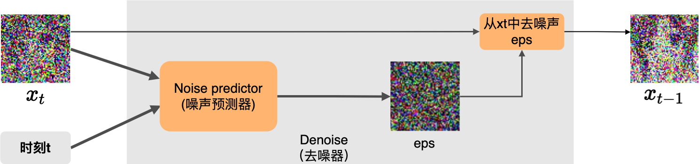
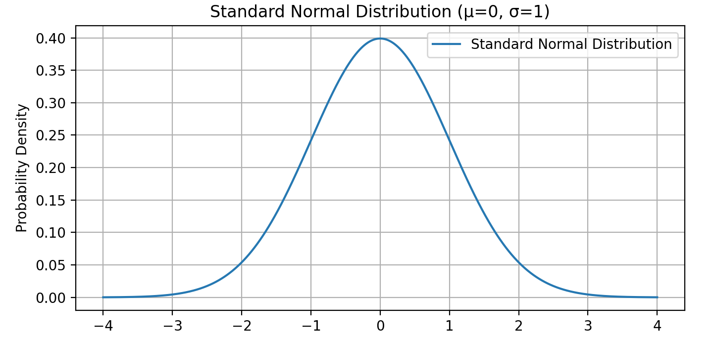
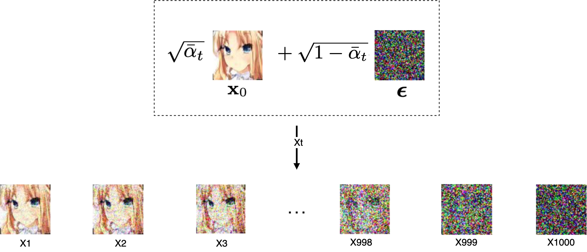

# 如何使用去噪扩散概率模型(DDPM)随机生成动漫头像

我想很多人都已经了解或者使用过stable diffusion，我想大家可能都会有个疑问，它是如何实现的或者它的原理到底是什么? 要回答这个问题需要很多的前置知识，所以我们先尝试回答一个更简单一些的问题：如何通过模型随机生成一个尺寸为64x64的RGB动漫头像？

## 尝试一次生成图像

我有两万张大小为64x64的RGB动漫头像数据，如下图所示：


那么我们能不能使用这些数据训练一个图片预测器，这个预测器可以用来一步直接生成一张新的动漫头像图片呢？为了验证这个想法，我们需要训练这个预测器，那么训练的数据和标签是什么呢？因为我们想要预测器直接生成动漫头像，所以我们可以将那两万张动漫头像本身作为标签，如下图所示。标签有了，那么训练预测器的输入是什么呢？


看起来我们并没有一个输入数据和标签的映射关系，那么我们可以使用任何东西作为输入，例如我们可以使用一张完全黑色的图片作为输入数据，如下图所示：


之后，图片预测器通过训练和学习，然后将输入数据（黑色图片）映射到标签（原图）。我们期望该预测器训练完成后就可以将一张完全黑色的图片转换成为一张新的动漫头像。但是实际上模型生成的是完全混乱模糊不清的图像。这表明了预测器的一个重要事实是：**如果同一输入有可能有多个可能的标签，那么预测器将会学习并输出所有标签的平均值**。然而一堆图像的平均值并不会产生有意义的图像。

## 尝试一次生成一个像素

既然一次生成所有的图像不太可行，那么让我们换个思路，尝试一个简单点的任务。这次我们不一次性生成整个图像，而是尝试补全一张缺失了部分像素的图片。如下图所示，我们使用缺失一部分像素的图片作为训练数据，将图像缺失的部分作为标签。


为了使任务最简单，我们先选择尝试补全一张缺失了一个像素的图片。在训练完成后，我们期望给预测器输入缺失一个像素的图片后，预测器可以预测缺失的那一个像素的值。但就像我们在之前遇到的问题，预测器会输出缺失像素可以采用的合理值的平均值，但是由于我们预测的只是一个像素，而一堆合理的颜色的平均值也只是一种颜色，所以平均值依然是有意义的。通过这种方式我们可以很好的完成一次预测一个缺失像素的任务。但是它只能预测一个像素，我们如何使得预测器可以预测两个像素呢？

我们可以训练另外一个预测器，它可以预测第二个被缺失的像素值。如下图所示，我们使用缺失两个像素的图片（一个像素不太好画，所以图中依然是个色块，但是请你将其想象成一个像素点）作为训练数据，将图像缺失的部分作为标签。


这样做有什么意义呢？对于一个缺失了两个像素的图像，我们可以使用第二个预测器预测第二个缺失的像素值，然后后使用第一个预测器来预测第一个缺失的像素值，如下图所示：


按照这个思路，我们可以针对每一个不同位置缺失的像素训练一个预测器，那么我可以实现从一张完全黑色的图片生成一张动漫图像。由于每个预测器只预测一个像素值，所以并没有生成的图片模糊的影响。这样从无到有生成了一张看似合理的图像。


但是现在还有一个小问题，如果我们通过模型多次生成图片，它将生成的是同一张图片。不过不用担心，我们可以引入随机采样来解决这个问题。首先让我们回过头来看看所有预测器的输出是什么？实际上它们输出的是可能的标签（一个像素值）的概率分布，如下图所示。


通常情况下，我们会选的可能标签的均值作为预测值。但是如果我想要生成随机的图片，我们可以通过随机的从这个概率分布中采样一个标签来作为预测值。通过这种方式模型在推测每个缺失像素时，通过随机采样可能的标签的概率分布，使得每个步骤采样不同的值，而每步的值又会影响预测后续步骤，从而可以生成随机的动漫图片。

实际上，我们刚创建的生成式模型叫做**自回归模型**（auto-regressor）。而自回归模型是诞生很早的一种生成式模型，虽然它是很早之前就有的技术，但是现在还是有很多地方在使用，如ChatGPT中就使用了自回归模型。但是在图片生成领域，已经很少使用自回归模型。这是因为回归模型需要对每一个元素创建一个新的神经网络，而对于64x64的RGB图像来说，它有64x64x3=12288维，也就是说自回归模型需要创建12288个神经网络，并且生成一张图片需要通过12288次生成图片的每一个维度值。那么如何解决这个问题呢？

### 尝试一次生成多个像素

对于我们刚创建的自回归模型，我们每次只移除一个像素，但其实我们没有必要一次只删除一个像素。我们可以一次移除多个像素值，比如，我们一次移除4x4的像素块。然后使用神经网络来预测所有16个缺失的像素。这相较于一次只移除一个像素，训练和生成的速度都会更快。但是这样做是有限制的，我们不能一次性移除太多像素，在极端情况下，如果我们尝试一次性移除所有的像素，那么我们就回到了一开始的情况，我们试图通过一步从一张完全黑色的图片来生成一张新的图片，它带来的问题是：**如果同一输入有可能有多个可能的标签，那么预测器将会学习并输出所有标签的平均值**，这将导致生成没有任何意义的图片。

为什么基于像素块的预测会导致生成图像质量下降呢？当模型预测一个像素块的时候，模型需要一次性决定这些值。但是此时会有很多种可能性来填充缺失的像素块，在这种情况下模型会输出这些值的平均值，由于模型无法在单个步骤中捕捉所有像素之间的相关性，所以模型没有办法确定这些值之间是连续的。而当模型一次只预测一个像素时，模型可以在每次预测下一个缺失像素值之前通过参考之前生成的的像素值来预测缺失的像素值。所以模型可以修改它的预测以便使得预测出的像素值和之前的像素之间是连续的。所以这里就需要做些权衡：**我们一次生成的像素越多，我们需要使用的计算就越少，但是相应的生成的质量就要更差一些。**

可以看到这个问题在我们预测的值它们彼此相关时发生。那么假设这些值之间彼此独立，即知道其一个像素值并不能帮助预测任何其它的像素值。在这种情况下，模型不需通过要查看之前生成的值来预测下一个缺失的值。那么，我们可以同时预测所有值而不丢失任何质量。但对于自然界的图像来说，相邻的像素之间有着很强的联系，因为通常情况下相邻的像素很可能属于同一个物体。当我们知道了一个像素的值后，通常可以帮助我们推测相邻像素的颜色。这意味着移除连续块中的像素实际上是很糟糕的方式。相反，我们应该同时移除那些距离较远的像素，这样可以降低这些移除像素之间的关联性。


所以，相较于一次移除一组连续的像素块，通过每次随机的移除一组像素值，我们获得了每步中移除更多像素的好处，与此同时，与一次移除一个像素相比不会丢失任何质量。为了最大限度的减少模型生成图片的步数，那我们希望每步中要删除的像素尽可能的分散。通过随机顺序移除像素是最大化平均分布的一个好的方法。如下图所示：


## 扩散模型是如何工作的？

> “雕塑在我开始工作之前，就已经在大理石块中完成了。它已经在那里，我只需要把多余的材料凿掉。” —— 米开朗基罗

扩散模型是如何工作的呢？比如我想通过模型随机生成一个尺寸为64x64的RGB动漫头像，扩散模型是如何来完成这样一个任务的呢？在正式回答这个问题之前，我们需要先了解一些关于图像的基本知识。

### RGB图像

我们常见的图像是具有三个通道(RGB)的彩色图，如下图所示：


我们可以使用矩阵来表达任意一张RGB图像。下图是一张16x16x3的图像，3代表RGB三个通道：


### 高斯噪声

DDPM中，生成图像的第一步就是随机采样一个服从标准正态分布（正态分布也叫高斯分布）的噪声，这个噪声叫做高斯噪声，生成的高斯噪声的大小和模型生成图片大小一致，我们可以把这个高斯噪声看作为一个高斯噪声图片。如下图所示，从标准正态分布中随机采样了一个大小为16x16x3的噪声图。


如果你也是一个小白，我想你的第一个问题已经产生了：随机采样一个服从标准正太分布的噪声是什么意思？我们可以暂时将标准正太分布看做一个黑箱，我们可以从黑箱中随机采样服从标准正态分布的噪声图片。


### 去噪过程(Denoise Process)

假设我们从标准正态分布中采样得到一张64x64x3的噪声图，在DDPM中噪声图片生成后会通过一个去噪(Denoise)组件对图片进行去噪，经过去噪的图片相较之前的噪声图片会稍稍变得更像一张正常的图片，之后重复此过程，假设重复次数为1000次（后面我会说明为什么是1000次），经过1000次去噪后，就得到了一个尺寸为64x64x3的动漫头像。过程如下图：


可以看到图片的噪声是经过去噪组件一点一点慢慢的去除掉的。实际上去噪的过程中去噪组件需要两个输入：
- 需要去噪的图片，用 $x_t$ 表示。如：$x_{1000}, x_{999}, ...,x_1, x_0$ 。
- 时刻(你也可以暂时将它理解为第几步)，用 $T$ 表示。如：$t_{1000}, t_{999}, ..., t_1, t_0$ 。至于为啥要把时刻 $T$ 作为一个输入和为什么时刻 $T$ 的取值从1000到1，我们后面会说明。

所以实际的去噪过程如下图：


现在，我们已经知道想要随机生成一张动漫头像需要对一张噪声图经过1000次去噪来完成。这个过程叫做Denoise Process也叫做Reverse Process，这个过程是不是就如同米开朗基罗说得那样: 雕塑在我开始工作之前，就已经在大理石块中完成了。它已经在那里，我只需要把多余的材料凿掉。在我们的例子中，就好比动漫头像已经存在于噪声图片中了，Denoise过程只是把多余的噪声去掉而已。

那么现在问题的关键就是：这个去噪组件是如何实现的呢？

### 去噪组件

在前面我们已经知道这个去噪组件的输入是
- 需要去噪的图片 $x_t$ 。
- 时刻 $T$ 。

输出是去噪后的图片 $x_{t-1}$。那么它的内部结构或者内部实现是什么样子呢？如下图，去噪组件主要包含两部分：
- 噪声预测器(Noise Predictor)
- 去噪器

当噪声组件接收到输入后，噪声预测器会根据需要去噪的图片 $x_t$ 和时刻 $T$ 预测出一个噪声，然后去噪器会使用某种方法将预测出的噪声从输入图片 $x_t$ 中去除，从而得到去噪后的图片 $x_{t-1}$ 。



那么理解噪声预测器如何工作的就变成了关键。

### 噪声预测器

实际上，噪声预测器是由一个神经网络(Neural Network)训练得来的。噪声预测器的目标就是根据需要去噪的图片 $x_t$ 和时刻 $T$ 预测出一个噪声。如图所示：


那么噪声预测器是如何训练得来的呢？很多人即便没有真正学习过神经网络，但是对训练神经网络有这么一个印象，那就是训练神经网络需要大量的训练数据并且需要对训练数据打标签。

在训练神经网络的过程中，对于某个数据集D，经过神经网络后会生成预测值，然后会通过这个预测值和实际值(数据D的标签)计算损失值，然后神经网络通过反向传播来不断的调整自己的权重矩阵，从而使得预测值和实际值的损失减小。其过程如下图：


那么对于我们的任务来说，要训练噪声预测器这个神经网络，首先我的要有一个动漫头像的数据集，这个数据集应该包含足够多不同种类的动漫头像。这里使用的数据集大概包含了两万张如下尺寸为64x64的动漫头像：


其次我们要对图片打标签吗？标签的内容是什么呢？让我们重新回顾一下噪声预测器的目标: 根据需要去噪的图片 $X_T$ 和时刻 $T$ 预测出一个噪声。

是不是发现有什么不对的地方了？噪声预测器的目标是预测噪声，我们如何给图片打噪声的标签呢？要回答这个问题我们首先要了解DDPM的扩散过程。

### 扩散过程(Diffusion Process)

想象一下一滴墨水滴入一杯清水中后的扩散过程，随着时间的推移，墨水渐渐的均匀的扩散至整个杯中。如果我们把整个扩散的过程看做为1000个时刻，那么：
- $t_0$ 时刻，墨汁还没有滴入杯中
- $t_1$ 时刻，墨汁才刚刚滴入杯中
- $t_2$ 时刻，墨汁扩散了一点点
- $t_{1000}$ 时刻，墨汁均匀的扩散到了整个杯中


DDPM的扩散过程和墨水滴入清水中的扩散过程相似，在DDPM中，噪声随着时间在整张图片上慢慢扩散，最终噪声均匀的扩散在整张图片上。


DDPM的扩散过程又叫前向过程(Forward Process)，它和去噪过程(Denoise Process)正好相反。如下图所示：
- 首先我们从训练的数据集中Sample一张原图 $x_0$ 。
- 然后对 $x_0$ 加噪，添加的噪声是随机采样自正太分布。添加噪声后得到加噪后的图片 $x_1$ 。
- 然后将 $x_1$ 作为下个步骤的输入，然后重复这个过程1000次，经过1000次加噪后得到了充满噪声的图片x_1000。


那么这个过程到底有啥用呢？好好的为啥要给图片加噪声呢？

其实这个过程是为了训练噪声预测器这个神经网络。让我们回到从 $x_0$ 加噪至 $x_1$ 的过程中。过程如下图所示，在这个过程中：
- 首先，通过采样标准正太分布得到了随机噪声eps_1
- 然后，对 $x_0$ 加噪eps_1后得到了 $x_1$
- 然后，将 $x_1$ 和当前的时刻 $t=1$ 作为神经网络的输入，得到神经网络的噪声预测值pre_eps_1。
- 然后，通过真实的eps_1和预测的pre_eps_1来计算损失
- 然后，神经网络通过反向传播来调整自己的权重矩阵，从而使得后面的预测值和真实值的损失变小。


重复这个过程1000次，最终整张图片充满的噪声。如下图所示：


在整个过程中，**每步中随机采样自正太分布的噪声成为每步中数据的“标签”，一张训练数据图片完成1000次不断的加噪和预测来训练神经网络(噪声预测器)**。当噪声预测器训练完毕后，就可以在去噪过程(Denoise process)中使用噪声预测器来预测需要去除的噪音。至于为什么要在训练神经网络的过程中加入时刻 $T$，这是因为在不同的时刻中我们所训练的是同一个神经网络，而在不同的时刻中所加入的噪声比例是有些区别的，所以我们需要告诉神经网络步数信息。

### 小结

现在我们再来回顾一下这个过程：
- 首先，需要利用扩散过程(Diffusion Process)来训练噪声预测器，噪声预测器一旦训练完之后，就可以拿来一直使用。
- 然后，在去噪过程(Denoise Process)中通过噪声预测器来预测每一步的噪声，经过1000步去噪音后得到了一张全新的干净的图片。

这个过程如下图所示：


到此为止，我想你对扩散模型大方向上是如何工作的已经有了一个基本的认识了。但是我猜你可能会有如下的一些问题：
- 噪声为何要采样自正太分布？啥是正太分布？
- 在加噪过程中，噪声是如何被加入到图像中的？
- 在去噪过程中，噪声是如何从图像中去除的？
- 为啥时刻T取值从1000到1？
- 噪声预测器的神经网络结构是什么样子的呢？如何构建这样的神经网络？以及它为何能够预测噪声？
- 这一切都是魔法吗？

要回答这些问题就得回到《Denoising Diffusion Probabilistic Models》这篇论文中。但在此之间我们需要学习一些关于正态分布的知识。

## 正态分布

在前面我们暂时将标准正太分布看做一个黑箱，我们可以从黑箱中随机采样我们想要尺寸大小的噪声图片。那么什么是正态分布？

正态分布，也称为高斯分布或钟形曲线，是一种常见的概率分布。在统计学中，它用于描述数据的分布情况。标准正态分布是正态分布的一个特例，下图是一个标准正态分布图，其均值为0，标准差为1，黄色区域为一个标准差范围:



正态分布的主要特点有：

- 对称性
    - 正态分布的曲线是对称的，中心点位于均值（平均值）处。
    - 这意味着数据在均值两侧的分布是一样的。
- 钟形曲线
    - 曲线形状像一个钟，左右两边逐渐下降，中间最高。
    - 大部分数据集中在均值附近，越远离均值的值出现的概率越小。
- 均值和标准差
    - 均值（μ）：分布的中心点，表示数据的平均值。
    - 标准差（σ）：衡量数据的分散程度。标准差越大，曲线越宽；标准差越小，曲线越窄。
- 68-95-99.7规则
    - 68% 的数据在均值的一个标准差范围内。
    - 95% 的数据在均值的两个标准差范围内。
    - 99.7% 的数据在均值的三个标准差范围内。    

正态分布的概率密度函数(PDF)定义为：

$$f(x) = \frac{1}{\sqrt{2\pi\sigma}}e^{[-\frac{x-\mu^2}{2\sigma^2}]}$$

从正态分布的概率密度函数表达式中可以知道，只有 $\mu$ 和 $\sigma$ 是未知参数，所以通过 $\mu$ 和 $\sigma$ 可以确定一个正态分布，我们可以使用如下的表达式来表达一个正态分布，其中N代表正态分布(Normal distribution):

$$N(\mu, \sigma^2)$$

标准正太分布的均值 $\mu = 0$，标准差 $\sigma = 1$ ，所以可以表示为：

$$N(0, 1)$$

在我们的例子中，我们采样出来高斯噪声是多维的，它是采样自多维标准正态分布，那么可以使用如下表达式来表达：
$$N(0, I)$$

### 正态分布的特性

在DDPM中选择使用正态分布的原因是因为正态分布有很多特性能够使得模型的训练和推理更简单和高效。这里我只列出几个我们后面需要用到的特性：

#### 闭合性
多个正态分布的线性组合仍然是正态分布。可以表示为:

$$N_1(\mu_1, \sigma_1^2) + N_2(\mu_2, \sigma_2^2)= N_3(\mu_1 + \mu_2, \sigma_1^2 + \sigma_2^2)$$

#### 重参数化技巧

假设我们有一个正态分布，均值为 $\mu$ ，标准差为 $\sigma$ ，通常情况下我们需要通过采样 $z \thicksim N(\mu, \sigma^2)$ 来生成随机变量 $z$ 。使用重参数化技巧，我们通过引入一个标准正态分布的随机变量 $\epsilon \thicksim N(0, 1)$ ，然后用它来生成所需的随机变量 $z = \mu + \sigma\cdot\epsilon$


## 扩散模型原理

在《Denoising Diffusion Probabilistic Models》这篇论文中，对于扩散和去噪过程有如下的定义：


这些公式看起来很复杂，实际也很复杂，但是理解这些公式却是理解DDPM原理的核心所在。

### 训练阶段(Training)

在之前我们也已经提到DDPM通过扩散过程来训练噪声预测器，所以我们可以将DDPM的Training对应到扩散过程(Diffusion Process)。在扩散过程中噪声是如何一点点扩散的呢？或者说噪声是如何一点点被加进来的呢？让我们再来回顾一下之前的加噪过程，如下图所示：


当加噪器添加噪声的时候，它是按照如下的数学公式定义来添加噪声的：


<!-- $$\sqrt{\beta}\times\epsilon + \sqrt{1-\beta} \times x$$ -->

公式中的
- $\epsilon$ 是通过采样标准正太分布得到了随机噪声eps
- $x$ 代表输入的图片
- $\beta$ 是一个介于0到1之间的数字，用做 $\epsilon$ 和 $\beta$ 的系数

在训练的过程中 $\beta$ 会随着时间 $T$ 的增大，由小到大逐渐增大，那么
- $\sqrt{\beta}\times\epsilon$ 的比例就会逐步变大，代表噪声占比越来越大。
- $\sqrt{1-\beta} \times x$ 的比例就会越来越小，代表输入图片占比越来越小。

<!-- 仔细观察噪声图的系数 $\sqrt{\beta}$ 和原图 $x$ 的系数，你会发现它们之间的关系满足勾股定理，即：

$$(\sqrt{\beta})^2 + (\sqrt{1-\beta})^2 = 1$$

至于这么做有什么特殊意义 -->

还记得之前步数 $T$ 吗？在之前的例子中，我们将 $T$ 设为1000，那么 $\beta$ 就会变成一个长度为1000的数组，数组中的值在0到1之间逐渐增大，如下面这个数组：
```
[
    0.0001564962795991276,
    0.0002104677074292738,
    0.0002644475827556783,
    0.0003184388213015587,
    ...
    0.7499932543469323234
    ...
    0.9999999999999999999
]
```

数组中的值如何分布，是通过不同的算法的决定的，但是无论如何，当 $T$ 固定时，我们可以认为 $\beta$ 就是一个提前设置好的已知的数组。至于 $T$ 为啥是1000呢？它就是一个经验值，其实它可以不是1000，你完全可以设置其它值。但是这个值不能设置的太小了，设置的太小步数就会减少，那么模型需要学习的难度就会变大。这个值也不能太大，太大了，步数变得很多相应的训练时间可能就会变长，最终的结果可能也提升不了多少。

通过引入 $T$ 后，我们可以重新表达之前的公式为：

$$x_t = \sqrt{\beta_t} \times \epsilon + \sqrt{1-\beta_t} \times x_{t-1}$$

其中 $x_0$ 为训练时使用的干净的原图。

为了简化后面的公式，现在我们引入一个新的变量 $\alpha$ , 并令 $\alpha = 1 - \beta$ ，那么，我们又可以重新表达之前的公式为：

$$x_t = \sqrt{1 - \alpha_t} \times \epsilon + \sqrt{\alpha_t} \times x_{t-1}$$

经过一些列复杂推导，得到：


<!-- $$x_t=\sqrt{\overline{\alpha}_t}x_0 + \sqrt{1-\overline{\alpha}_t}\epsilon$$ -->

其中 

$$\overline{\alpha_t} = \alpha_1 \times \alpha_2 \times ... \times \alpha_{t-1} \times \alpha_t $$ 

由于 $\beta$ 是已知的，所以任意时刻的 $\overline{\alpha_t}$ 也是已知的。这个公式得到了一个比较重要的结论就是：**对于任意 $x_t$ 可以由原图 $x_0$ 直接生成**。如下图所示：



现在我们已经可以通过 $x_0$ 生成任意时刻的加噪图 $x_t$，那么我们就可以将 $x_t$ 和t作为训练噪声预测器的输入，这里我们使用 $\epsilon_\theta$ 来表示噪声预测器, $\theta$ 表示神经网络的权重参数。那么我可以使用如下公式来表达训练噪声预测器：

$$\epsilon_\theta(\sqrt{\overline{a}_t}x_0 + \sqrt{1-\overline{a}_t}\epsilon, t)$$

通过 $\epsilon_\theta$ 之后我们就得到了预测噪声。然后，使用如下公式来计算真实噪声和预测噪声的均方误差(MSE)：

$$||\epsilon - \epsilon_\theta(\sqrt{\overline{a}}x_0 + \sqrt{1-\overline{a}_t}\epsilon, t)||^2$$

其过程如下图所示：


而如下公式表示是神经网络在反向传播中通过梯度下降算法更新模型参数 $\theta$，以使得模型估计的噪声 $\epsilon_\theta$ 更加接近实际噪声 $\theta$。

$$\nabla_\theta ||\epsilon - \epsilon_\theta(\sqrt{\overline{a}_t}x_0 + \sqrt{1-\overline{a}_t}\epsilon, t)||^2$$

### 采样阶段(Sampling)

我们可以将DDPM的Sampling对应到去噪过程(Denoise Process)，去噪过程如下图所示：


在去噪过程中，首先我们需要随机采样一个服从正太分布的噪声 $x_T$，使用公式 $x_T \sim N(0, I)$ 来表达。之后使用噪声预测器来预测噪声，使用公式 $\epsilon_\theta(x_t, t)$ 来表达。最后通过如下公式来计算 $x_{t-1}$ :


<!-- $$x_{t-1} = \frac{1}{\sqrt{\alpha_t}}(x_t - \frac{1 - \alpha_t}{\sqrt{1 - \overline{\alpha_t}}}\epsilon_\theta(x_t, t)) + \sigma_t z$$ -->

这个公式是如何推导出来的我们后面再说，其中 $z$ 采样自标准正太分布：
$$z \sim N(0,I)$$

而 $\sigma_t$ 定义如下：
$$\sigma_t = \sqrt{\frac{(1 - \alpha_t)(1 -  \overline{\alpha}_{t - 1})}{ 1 - \overline{\alpha}_t}}$$

所以，我们可以将其表示为：


在我们之前的例子中，我们将 $T$ 设为1000，那么去噪过程的第一步就是在标准正态分布中采样高斯噪声 $x_{1000} \sim N(0, I)$ ，之后通过 $x_{t-1}$ 的公式一步步去除由噪声预测器 $\epsilon_\theta$ 预测出的噪声，最终生成 $x_0$ 。

### 小结

到此为止，我想你对于扩散模型是如何运行的有了更细节的了解。


其中画线的几个问题应该也得到了解答：
- ~~啥是正太分布？~~
- 噪声为何要采样自正太分布？
- ~~在加噪过程中，噪声是如何被加入到图像中的？~~
- ~~在去噪过程中，噪声是如何从图像中去除的？~~
- ~~为啥时刻T的取值是从1000到1呢？~~
- 噪声预测器的神经网络结构是什么样子的呢？如何构建这样的神经网络？以及它为何能够预测噪声？
- 这一切都是魔法吗？

与此同时，也可能又新增了几个问题，比如：
- Training和Sampling中的加噪和去噪公式是如何推导出来的？

但是围绕在我心头最难以理解的是：为啥要给通过加噪声的方式来训练模型？为啥要通过多步加噪来训练模型，然后又通过多步去噪来生成图片？这一切的本质到底是什么？最初的想法到底是源于什么？


