# 如何使用去噪扩散概率模型(DDPM)随机生成动漫头像

我想很多人都已经了解或者使用过stable diffusion，大家可能都会有个疑问，它是如何实现的或者它的原理到底是什么? 要回答这个问题需要很多的前置知识，所以我们先尝试回答一个更简单一些的问题：如何通过模型随机生成一个尺寸为64x64的RGB动漫头像？但在正式回答这个问题之前，我们需要先了解一些关于图像的基本知识。

### RGB图像

我们常见的图像是具有三个通道(RGB)的彩色图，如下图所示：


我们可以使用矩阵来表达任意一张RGB图像。下图是一张16x16x3的图像，3代表RGB三个通道：


但在接下来的内容中，为了简单，我可能会在很多地方忽略RGB图像的3个通道。但实际上我们当你思考一个像素的时候，你需要知道一个像素其实是由RGB三个维度的值来决定的。


## 尝试一次生成图像

我有两万张大小为64x64的RGB动漫头像数据，如下图所示：


那么我们能不能使用这些数据训练一个图片预测器，这个预测器可以用来一步直接生成一张新的动漫头像图片呢？为了验证这个想法，我们需要训练这个预测器，那么训练的数据和标签是什么呢？因为我们想要预测器直接生成动漫头像，所以我们可以将那两万张动漫头像本身作为标签，如下图所示:

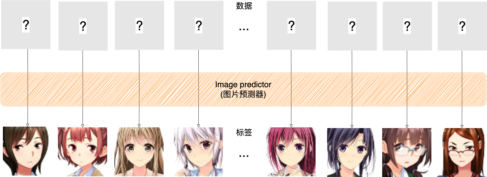

标签有了，那么训练预测器的输入是什么呢？看起来我们并没有一个输入数据和标签的映射关系，那么我们可以使用任何东西作为输入，例如我们可以使用一张完全黑色的图片作为输入数据，如下图所示：

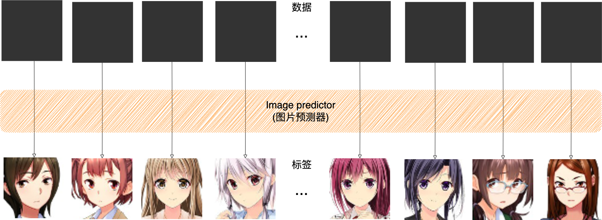

之后，图片预测器通过训练和学习，然后将输入数据（黑色图片）映射到标签（原图）。我们期望该预测器训练完成后就可以将一张完全黑色的图片转换成为一张新的动漫头像。但是实际上模型生成的是完全混乱模糊不清的图像。这表明了预测器的一个重要事实是：**如果同一输入有可能有多个可能的标签，那么预测器将会学习并输出所有标签的平均值**。然而一堆图像的平均值并不会产生有意义的图像。

## 尝试一次生成一个像素

既然一次生成所有的图像不太可行，那么让我们换个思路，尝试一个简单点的任务。这次我们不一次性生成整个图像，而是尝试补全一张缺失了部分像素的图片。如下图所示，我们使用缺失一部分像素的图片作为训练数据，将图像缺失的部分作为标签。


为了使任务最简单，我们先选择尝试补全一张缺失了一个像素的图片。在训练完成后，我们期望给预测器输入缺失一个像素的图片后，预测器可以预测缺失的那一个像素的值。但就像我们在之前遇到的问题，预测器会输出缺失像素可以采用的合理值的平均值，但是由于我们预测的只是一个像素，而一堆合理的颜色的平均值也只是一种颜色，所以平均值依然是有意义的。通过这种方式我们可以很好的完成一次预测一个缺失像素的任务。但是它只能预测一个像素，我们如何使得预测器可以预测两个像素呢？

我们可以训练另外一个预测器，它可以预测第二个被缺失的像素值。如下图所示，我们使用缺失两个像素的图片（一个像素不太好画，所以图中依然是个色块，但是请你将其想象成一个像素点）作为训练数据，将图像缺失的部分作为标签。

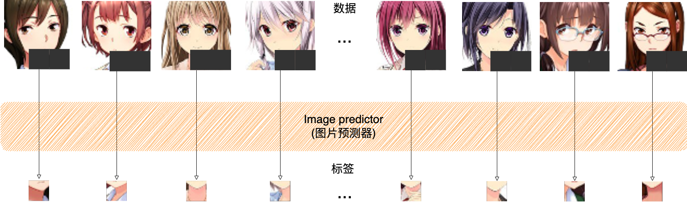

这样做有什么意义呢？对于一个缺失了两个像素的图像，我们可以使用第二个预测器预测第二个缺失的像素值，然后后使用第一个预测器来预测第一个缺失的像素值，如下图所示：

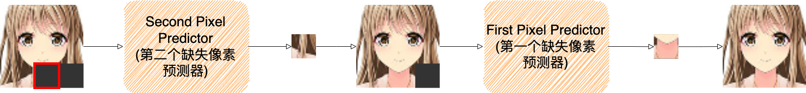

按照这个思路，我们可以针对每一个不同位置缺失的像素训练一个预测器，那么我可以实现从一张完全黑色的图片生成一张动漫图像。由于每个预测器只预测一个像素值，所以并没有生成的图片模糊的影响。这样从无到有生成了一张看似合理的图像。


但是现在还有一个小问题，如果我们通过模型多次生成图片，它将生成的是同一张图片。不过不用担心，我们可以引入随机采样来解决这个问题。首先让我们回过头来看看所有预测器的输出是什么？实际上它们输出的是可能的标签（一个像素值）的概率分布，如下图所示。

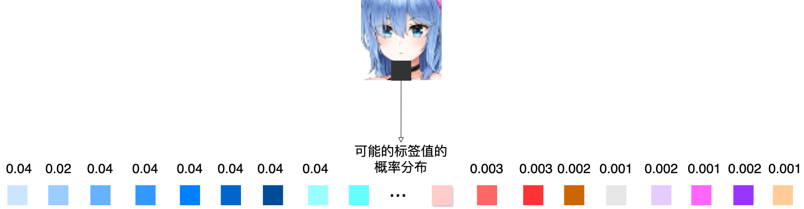

通常情况下，我们会选择可能标签的均值作为预测值。但是如果我想要生成随机的图片，我们可以通过随机的从这个概率分布中采样一个标签来作为预测值。通过这种方式模型在推测每个缺失像素时，通过随机采样可能的标签的概率分布，使得每个步骤采样不同的值，而每步的值又会影响预测后续步骤，从而可以生成随机的动漫图片。

实际上，我们刚创建的生成式模型叫做**自回归模型**（auto-regressor）。而自回归模型是诞生很早的一种生成式模型，虽然它是很早之前就有的技术，但是现在还是有很多地方在使用，如ChatGPT中就使用了自回归模型。但是在图片生成领域，已经很少使用自回归模型。这是因为回归模型需要对每一个元素创建一个神经网络，而对于64x64的RGB图像来说，它有64x64x3=12288维，也就是说自回归模型需要创建12288个神经网络，并且生成一张图片需要通过12288次生成图片的每一个维度值。然而我们真的必须要训练12288不同的神经网络吗？其实我们可以训练同一个神经网络，但是在训练的过程中我们需要告知神经网络所针对的像素的位置信息。例如，在训练移缺失的第一个像素时，我们训练神经网络的输入：
- 缺少一个像素的图像
- 位置信息1

在训练移缺失的第二个像素时，我们训练神经网络的输入：
- 除了缺少两个像素的图像
- 位置信息2

对于所有位置的像素可以如此类推。但即便我们可以只训练一个神经网络来预测不同位置像素的值，但是生成一张64x64的RGB图像仍需要12288步，通常来说这意味着生成的时间会比较长。那么如何来加速生成速度而不降低生成图像的质量呢？

### 尝试一次生成多个像素

对于我们刚创建的自回归模型，我们每次只移除一个像素，但其实我们没有必要一次只删除一个像素。我们可以一次移除多个像素值，比如，我们一次移除4x4的像素块。然后使用神经网络来预测所有16个缺失的像素。这相较于一次只移除一个像素，训练和生成的速度都会更快。但是这样做是有限制的，我们不能一次性移除太多像素，在极端情况下，如果我们尝试一次性移除所有的像素，那么我们就回到了一开始的情况，我们试图通过一步从一张完全黑色的图片来生成一张新的图片，它带来的问题是：**如果同一输入有可能有多个可能的标签，那么预测器将会学习并输出所有标签的平均值**，这将导致生成没有任何意义的图片。

而且基于像素块的预测会导致生成图像质量下降，这其中的原因是什么呢？当模型预测一个像素块的时候，模型需要一次性决定这些值。但是此时会有很多种可能性来填充缺失的像素块，在这种情况下模型会输出这些值的平均值，由于模型无法在单个步骤中捕捉所有像素之间的相关性，所以模型没有办法确定这些值之间是连续的。而当模型一次只预测一个像素时，模型可以在每次预测下一个缺失像素值之前通过参考之前生成的的像素值来预测缺失的像素值，那么模型可以修改它的预测以便使得预测出的像素值和之前的像素之间是连续的。所以这里就需要做些权衡：**一次生成的像素越多，需要使用的计算就越少，但是相应的生成的质量就要更差一些。**

可以看到这个问题只在我们预测的值它们彼此相关时发生。那么假设这些值之间彼此独立，即知道其一个像素值并不能帮助预测任何其它的像素值。在这种情况下，模型就不需通过要查看之前生成的值来预测下一个缺失的值。那么，我们可以同时预测所有值而不丢失质量。但对于自然界的图像来说，相邻的像素之间有着很强的联系，因为通常情况下相邻的像素很可能属于同一个物体，也就是说当我们知道了一个像素的值后，通常可以帮助我们推测相邻像素的颜色。这意味着移除连续块中的像素实际上是很糟糕的方式。相反，我们应该同时移除那些距离较远的像素，这样可以降低这些移除像素之间的关联性。


所以，相较于一次移除一组连续的像素块，通过每次随机的移除一组像素值，我们获得了每步中移除更多像素的好处，与此同时，与一次移除一个像素相比并不会丢失质量。那么为了最大限度的减少模型生成图片的步数，我们希望每步中要删除的像素尽可能的分散，也就是最大化平均分布，而通过随机顺序的移除像素看起来是一个不错的方法。如下图所示：

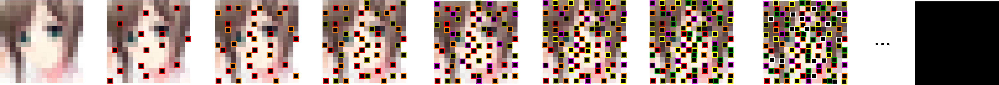

但其实还有更好的方式。首先，让我们再回顾一下训练一个模型来自动生成图片的过程。我们可以把生成式模型想象成两个过程：
- 去除过程：去除过程逐渐的从输入中删除信息，直到删除所有信息。
- 生成过程：生成过程使用神经网络来预测删除的信息，然后将信息添加回来。


但是是到目前为止，无论是一次删除一个像素，还是一次删除多个像素，我都是完全的删除整个像素，但其实我们可以只删除一个像素的部分信息。例如，我们可以通过添加少量噪音到图像上来达到这个目的，这个噪音是随机采样自噪声分布，如下图所示。


当我们往一张图片中添加少量噪音后，如果只通过噪声图，虽然我们是无法确切的知道加噪前的原始像素值是什么，但我们知道它的值接近于噪声值，这是因为我们每步只添加了少量的噪声。通过这种方式我们可以通过一步从一张图片的每个像素移除部分信息，这是目前为止最分散的方式来删除信息。

但现在还有一个小问题。当我们利用模型生成一张新的图片时，我们需要一些初始空白图像来作为模型生成图像的输入。在前面的例子中，在去除过程中，最终每张图片都会变成一张完全黑色的图像，我们可以认为最终图片都收敛到了一张完全黑色的图片，而完全黑色图像就是在生成过程中开始生成图像的地方。但是现在，如果我们不停的加噪，那么图片的像素值只会变得越来越大，并且永远不会收敛。如下图所示：


而我们希望的是最终的加噪图像能够收敛到噪声分布，这样我们就可以在生成过程中使用噪声分布中采样的噪声做为生成图片开始的地方。所以我们应该从什么地方开始生成图片呢？我们可以通过对加噪的方式做一点修改来解决这个问题。具体如何来做呢？如下图所示，我首先对原图的像素值占比进行缩放，同时噪声值进行比例缩放，然后再将两个缩放值进行相加得到了加噪后的图像：


公式中的
- $\epsilon$ 是随机采样自噪声分布的噪声图片
- $x$ 代表输入的图片
- $\beta$ 是一个介于0到1之间的数字，用做 $\epsilon$ 和 $\beta$ 的系数

在训练的过程中 $\beta$ 会随着时间增大，由小到大逐渐增大，那么
- $\sqrt{\beta}\times\epsilon$ 的比例就会逐步变大，代表噪声占比越来越大。
- $\sqrt{1-\beta} \times x$ 的比例就会越来越小，代表输入图片占比越来越小。

假设加噪过程为1000步，那么 $\beta$ 就会变成一个长度为1000的数组，数组中的值在0到1之间逐渐增大，如下面这个数组：
```
[
    0.0001564962795991276,
    0.0002104677074292738,
    0.0002644475827556783,
    0.0003184388213015587,
    ...
    0.7499932543469323234
    ...
    0.9999999999999999999
]
```

数组中的值通过一些算法的决定的，这里我们就先不讨论 $\beta$ 是如何计算出来的。但是无论如何，当加噪步数固定时，我们可以认为 $\beta$ 就是一个提前设置好的已知的数组。至于加噪步数到底要设置为多少呢？1000？500，200还是100呢？它就是一个经验值，你完全可以尝试设置其它值。但是这个值不能设置的太小了，设置的太小步数就会减少，那么模型需要学习的难度就会变大。这个值也不能太大，太大了，步数变得很多相应的训练时间可能就会变长，最终的结果可能也提升不了多少。

通过这种方式我们可以确保当我们重复多次加噪后，因为原始图像所占的比例越来越小，直到几乎为零，所以原始图像将会逐渐消失，而最终的噪声图像等同于直接从噪声分布中随机采样了一张噪声图像，也就是说最终加噪的图像的分布会收敛到噪声分布，如下图所示：


那么我们可以将随机采样自噪声分布的噪声图像作为生成过程中开始的地方，通过噪声图像逐步去噪来生成新的图像，如下图所示，$x_{1000}$ 是采样自噪声分布的噪声图 ：

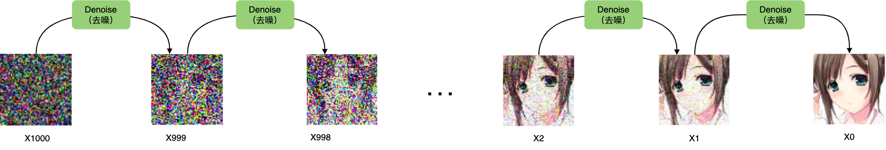

实际上，这种在去除过程通过逐步加噪，在生成过程中逐步去噪的生成式模型叫做**噪声扩散概率模型**（DDPM：Denoising Diffusion Probabilistic Models）。很多时候会被简称为扩散模型（Diffusion Models）。为什么要叫做扩散模型呢？想象一下一滴墨水滴入一杯清水中后的扩散过程，随着时间的推移，墨水渐渐的均匀的扩散至整个杯中。如果我们把整个扩散的过程看做为1000个时刻，那么：
- $t_0$ 时刻，墨汁还没有滴入杯中
- $t_1$ 时刻，墨汁才刚刚滴入杯中
- $t_2$ 时刻，墨汁扩散了一点点
- $t_{1000}$ 时刻，墨汁均匀的扩散到了整个杯中

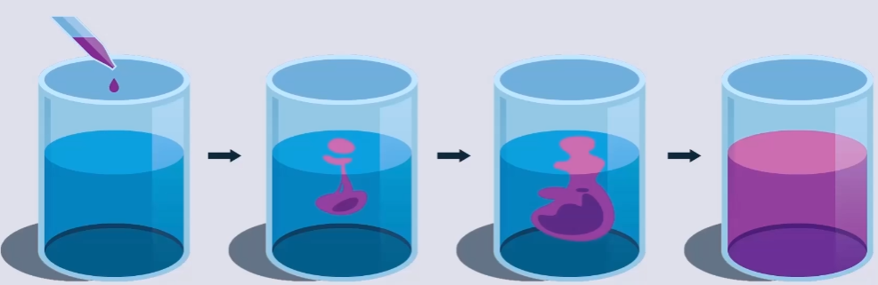

DDPM的扩散过程和墨水滴入清水中的扩散过程相似，在DDPM中，噪声随着时间在整张图片上慢慢扩散，最终噪声均匀的扩散在整张图片上。如下图所示：
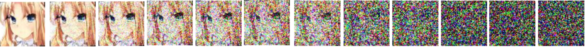


相对应我们之前总结的两个过程：**去除过程**和**生成过程**，DDPM中有：
- 扩散过程(Diffusion process)：扩散过程也叫加噪过程，扩散过程会一点点的对原图进行加噪，最终加噪的图像的分布会收敛到噪声分布。
- 去噪过程(Denoising process)：去噪过程会一点点的去除噪声，最终生成一张新的图像。

那么扩散模型具体是如何工作的？

## 扩散模型是如何工作的？

> “雕塑在我开始工作之前，就已经在大理石块中完成了。它已经在那里，我只需要把多余的材料凿掉。” —— 米开朗基罗

比如我想通过模型随机生成一个尺寸为64x64的RGB动漫头像，扩散模型是如何来完成这样一个任务的呢？


### 高斯噪声

DDPM中，生成图像的第一步就是从噪声分布中随机采样噪声。而在DDPM中这个噪声分布指的就是标准正态分布（正态分布也叫高斯分布），所以从噪声分布中采样的噪声也叫做高斯噪声，生成的高斯噪声的大小和模型生成图片大小一致，我们可以把这个高斯噪声看作为一个高斯噪声图片。如下图所示，从标准正态分布中随机采样了一个大小为16x16x3的噪声图。


我们可以暂时将噪声分布或者标准正态分布看做一个黑箱，我们可以从黑箱中随机采样服从标准正态分布的噪声图片。


### 去噪过程(Denoising Process)

假设我们从标准正态分布中采样得到一张64x64x3的噪声图，在DDPM中噪声图片生成后会通过一个去噪(Denoising)组件对图片进行去噪，经过去噪的图片相较之前的噪声图片会稍稍变得更像一张正常的图片，之后重复此过程，假设重复次数为1000次，经过1000次去噪后，就得到了一个尺寸为64x64x3的动漫头像。过程如下图：


可以看到图片的噪声是经过去噪组件一点一点慢慢的去除掉的。实际上去噪的过程中去噪组件需要两个输入：
- 需要去噪的图片，用 $x_t$ 表示。如：$x_{1000}, x_{999}, ...,x_1, x_0$ 。
- 时刻(你也可以暂时将它理解为第几步)，用 $T$ 表示。如：$t_{1000}, t_{999}, ..., t_1, t_0$ 。

所以实际的去噪过程如下图：


现在，我们已经知道想要随机生成一张动漫头像需要对一张噪声图经过1000次去噪来完成。这个过程叫做Denoising Process也叫做Reverse Process，这个过程是不是就如同米开朗基罗说得那样: 雕塑在我开始工作之前，就已经在大理石块中完成了。它已经在那里，我只需要把多余的材料凿掉。在我们的例子中，就好比动漫头像已经存在于噪声图片中了，Denoising过程只是把多余的噪声去掉而已。

那么现在问题的关键就是：这个去噪组件是如何实现的呢？

### 去噪组件

在前面我们已经知道这个去噪组件的输入是
- 需要去噪的图片 $x_t$ 。
- 时刻 $T$ 。

输出是去噪后的图片 $x_{t-1}$。那么它的内部结构或者内部实现是什么样子呢？如下图，去噪组件主要包含两部分：
- 噪声预测器(Noise Predictor)
- 去噪器

当噪声组件接收到输入后，噪声预测器会根据需要去噪的图片 $x_t$ 和时刻 $T$ 预测出一个噪声，然后去噪器会使用某种方法将预测出的噪声从输入图片 $x_t$ 中去除，从而得到去噪后的图片 $x_{t-1}$ 。


那么理解噪声预测器如何工作的就变成了关键。

### 噪声预测器

噪声预测器是由一个神经网络(Neural Network)训练得来的。噪声预测器的目标就是根据需要去噪的图片 $x_t$ 和时刻 $T$ 预测出一个噪声。如图所示：


可以看到训练神经网络需要两个输入：
- 需要去噪的图片 $x_t$ 。
- 时刻 $T$ 。

至于为什么要在训练神经网络的过程中加入时刻 $T$，这是因为在不同的时刻中我们所训练的是同一个神经网络，而在不同的时刻中所加入的噪声比例是有些区别的，所以我们需要告诉神经网络步数信息。否则，我们需要针对不同的 $T$ 时刻训练不同的神经网络。

那么我们要如何训练这个神经网络呢？要回答这个问题我们首先要了解DDPM的扩散过程。

### 扩散过程(Diffusion Process)

DDPM的扩散过程又叫前向过程(Forward Process)，它和去噪过程(Denoise Process)正好相反。如下图所示：
- 首先我们从训练的数据集中采样一张原图 $x_0$ 。
- 然后对 $x_0$ 加噪，添加的噪声是随机采样自正太分布。添加噪声后得到加噪后的图片 $x_1$ 。
- 然后将 $x_1$ 作为下个步骤的输入，然后重复这个过程1000次，经过1000次加噪后得到了充满噪声的图片x_1000。


那么这个过程到底有啥用呢？好好的为啥要给图片加噪声呢？

其实这个过程是为了训练噪声预测器这个神经网络。让我们回到从 $x_0$ 加噪至 $x_1$ 的过程中。过程如下图所示，在这个过程中：
- 首先，通过采样标准正太分布得到了随机噪声eps_1
- 然后，对 $x_0$ 加噪eps_1后得到了 $x_1$
- 然后，将 $x_1$ 和当前的时刻 $t=1$ 作为神经网络的输入，得到神经网络的噪声预测值pre_eps_1。
- 然后，通过真实的eps_1和预测的pre_eps_1来计算损失
- 然后，神经网络通过反向传播来调整自己的权重矩阵，从而使得后面的预测值和真实值的损失变小。


重复这个过程1000次，最终整张图片充满的噪声。如下图所示：


在整个过程中，**每步中随机采样自正太分布的噪声成为每步中数据的“标签”，一张训练数据图片完成1000次不断的加噪和预测来训练神经网络(噪声预测器)**。当噪声预测器训练完毕后，就可以在去噪过程(Denoise process)中使用噪声预测器来预测需要去除的噪音。

### 小结

现在我们再来回顾一下这个过程：
- 首先，在扩散过程(Diffusion Process)训练噪声预测器，噪声预测器一旦训练完之后，就可以拿来一直使用。
- 然后，在去噪过程(Denoising Process)中通过噪声预测器来预测每一步的噪声，经过1000步去噪音后得到了一张全新的干净的图片。

这个过程如下图所示：


到此为止，我想你对扩散模型大方向上是如何工作的已经有了一个基本的认识了。但是我猜你可能会有如下的一些问题：
- 啥是正太分布？噪声为何要采样自正太分布？
- 在去噪过程中，噪声是如何从图像中去除的？
- 噪声预测器的神经网络结构是什么样子的呢？如何构建这样的神经网络？以及它为何能够预测噪声？

要回答这些问题就得回到《Denoising Diffusion Probabilistic Models》这篇论文中。但在此之间我们需要学习一些关于正态分布的知识。


## 扩散模型原理

在《Denoising Diffusion Probabilistic Models》这篇论文中，对于扩散和去噪过程有如下的定义：


这些公式看起来很复杂，实际也很复杂，但是理解这些公式却是理解DDPM原理的核心所在。

### 训练阶段(Training)

在之前我们也已经提到DDPM通过扩散过程来训练噪声预测器，所以我们可以将DDPM的Training对应到扩散过程(Diffusion Process)。在扩散过程中噪声是如何一点点扩散的呢？或者说噪声是如何一点点被加进来的呢？让我们再来回顾一下之前的加噪过程，如下图所示：


当加噪器添加噪声的时候，它是按照如下的数学公式定义来添加噪声的：

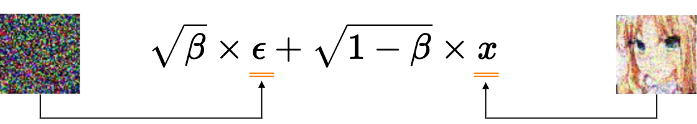

通过引入 $T$ 后，我们可以重新表达之前的公式为：

$$x_t = \sqrt{\beta_t} \times \epsilon + \sqrt{1-\beta_t} \times x_{t-1}$$

其中 $x_0$ 为训练时使用的干净的原图。可以看到，如果我们需要计算 $x_2$ 时刻的噪声图，我们需要先计算出 $x_1$ ，然后带入公式计算 $x_2$ 。同理，如果我们要计算出 $t$ 时刻的噪声图，那么我们计算出 $x_1, x_2, x_3,...,x_{t-1}$ ，虽然通过计算机计算这些也没有什么太大的难度，但其实这里还有更好的方式。

我们可以通过推导来简化这个过程。为了简化后面的公式，现在我们引入一个新的变量 $\alpha$ , 并令 $\alpha = 1 - \beta$ ，那么，我们又可以重新表达之前的公式为：

$$x_t = \sqrt{1 - \alpha_t} \times \epsilon + \sqrt{\alpha_t} \times x_{t-1}$$

经过一些列复杂推导，得到：


我们先暂时忽略这个公式是如何推导出来的，我先看看使用这个推导出来的公式能够做些什么。这个公式中多了一个之前没有的参数 $\overline{\alpha_t}$ , 下面是它的定义： 

$$\overline{\alpha_t} = \alpha_1 \times \alpha_2 \times ... \times \alpha_{t-1} \times \alpha_t $$ 

可以看到 $\overline{\alpha_t}$ 只不过是一种简写的方式，由于 $\beta$ 是已知的，所以任意时刻的 $\overline{\alpha_t}$ 也是已知的。这个公式得到了一个比较重要的结论就是：**对于任意 $x_t$ 可以由原图 $x_0$ 直接生成**。如下图所示：


我们知道训练噪声预测器这个神经网络需要将 $x_t$ 作为训练的一个输入，如下图所示：


这里我们使用 $\epsilon_\theta$ 来表示噪声预测器, $\theta$ 表示神经网络的权重参数。我可以使用如下公式来表达训练噪声预测器：

$$\epsilon_\theta(x_t, t)$$

现在我们已经可以通过 $x_0$ 生成任意时刻的加噪图 $x_t$，所以我们可以使用这个关于 $x_0$ 的公式来代表任意时候的加噪图 $x_t$ ，那么我可以使用如下公式来表达训练噪声预测器。

$$\epsilon_\theta(\sqrt{\overline{a}_t}x_0 + \sqrt{1-\overline{a}_t}\epsilon, t)$$

通过 $\epsilon_\theta$ 之后我们就得到了预测噪声。然后，使用如下公式来计算真实噪声和预测噪声的均方误差(MSE)：

$$||\epsilon - \epsilon_\theta(\sqrt{\overline{a}}x_0 + \sqrt{1-\overline{a}_t}\epsilon, t)||^2$$

其过程如下图所示：


而如下公式表示是神经网络在反向传播中通过梯度下降算法更新模型参数 $\theta$，以使得模型估计的噪声 $\epsilon_\theta$ 更加接近实际噪声 $\theta$。

$$\nabla_\theta ||\epsilon - \epsilon_\theta(\sqrt{\overline{a}_t}x_0 + \sqrt{1-\overline{a}_t}\epsilon, t)||^2$$

### 采样阶段(Sampling)

我们可以将DDPM的Sampling对应到去噪过程(Denoise Process)，去噪过程如下图所示：


在去噪过程中，首先我们需要随机采样一个服从正太分布的噪声 $x_T$，使用公式 $x_T \sim N(0, I)$ 来表达。之后使用噪声预测器来预测噪声，使用公式 $\epsilon_\theta(x_t, t)$ 来表达。最后通过如下公式来计算 $x_{t-1}$ :


同样，我们先暂时忽略这个公式是如何推导出来的，我先看看使用这个推导出来的公式能够做些什么。这个公式中 $z$ 采样自标准正太分布：
$$z \sim N(0,I)$$

而 $\sigma_t$ 定义如下：
$$\sigma_t = \sqrt{\frac{(1 - \alpha_t)(1 -  \overline{\alpha}_{t - 1})}{ 1 - \overline{\alpha}_t}}$$

所以，我们可以将其表示为：
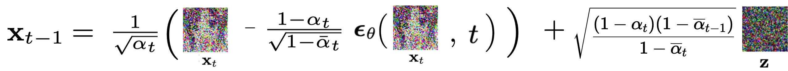

在我们之前的例子中，我们将 $T$ 设为1000，那么去噪过程的第一步就是在标准正态分布中采样高斯噪声 $x_{1000} \sim N(0, I)$ ，之后通过 $x_{t-1}$ 的公式一步步去除由噪声预测器 $\epsilon_\theta$ 预测出的噪声，最终生成 $x_0$ 。

### 小结

到此为止，我想你对于扩散模型是如何运行的有了更细节的了解。


其中画线的几个问题应该也得到了解答：
- 啥是正太分布？噪声为何要采样自正太分布？
- ~~在去噪过程中，噪声是如何从图像中去除的？~~
- 噪声预测器的神经网络结构是什么样子的呢？如何构建这样的神经网络？以及它为何能够预测噪声？

与此同时，也可能又新增了几个问题，比如：
- Training和Sampling中的加噪和去噪公式是如何推导出来的？

但是，围绕在我心头最大的疑问是，DDPM的底层原理或者说本质到底是什么？但在此之前让我们先了解一些关于正态分布的知识。

## 正态分布

在前面我们暂时将标准正太分布看做一个黑箱，我们可以从黑箱中随机采样我们想要尺寸大小的噪声图片。那么什么是正态分布？

网上关于正态分布已经有非常多的介绍，我这里不会详细的介绍。正态分布也称为高斯分布或钟形曲线，是一种常见的概率分布。在统计学中，它用于描述数据的分布情况。正态分布的概率密度函数(PDF)定义为：

$$f(x) = \frac{1}{\sqrt{2\pi\sigma}}e^{[-\frac{x-\mu^2}{2\sigma^2}]}$$
其概率密度函数图像如下图所示：


从正态分布的概率密度函数表达式中可以知道，只有 $\mu$ 和 $\sigma$ 是未知参数，所以通过 $\mu$ 和 $\sigma$ 可以确定一个正态分布，我们可以使用如下的表达式来表达一个正态分布，其中N代表正态分布(Normal distribution):

$$N(\mu, \sigma^2)$$

标准正太分布的均值 $\mu = 0$，标准差 $\sigma = 1$ ，所以可以表示为：

$$N(0, 1)$$

在我们的例子中，我们采样出来高斯噪声是多维的，它是采样自多维标准正态分布，那么可以使用如下表达式来表达：
$$N(0, I)$$

### 正态分布的特性

在DDPM中选择使用正态分布的原因是因为正态分布有很多特性能够使得模型的训练和推理更简单和高效。这里我只列出几个我们后面需要用到的特性：

#### 闭合性
多个正态分布的线性组合仍然是正态分布。可以表示为:

$$N_1(\mu_1, \sigma_1^2) + N_2(\mu_2, \sigma_2^2)= N_3(\mu_1 + \mu_2, \sigma_1^2 + \sigma_2^2)$$

#### 重参数化技巧

假设我们有一个正态分布，均值为 $\mu$ ，标准差为 $\sigma$ ，通常情况下我们需要通过采样 $z \thicksim N(\mu, \sigma^2)$ 来生成随机变量 $z$ 。使用重参数化技巧，我们通过引入一个标准正态分布的随机变量 $\epsilon \thicksim N(0, 1)$ ，然后用它来生成所需的随机变量 $z = \mu + \sigma\cdot\epsilon$

## 扩散模型的本质

想象一下有这么一个神秘的箱子，我们可以从箱子中抽取出一张张的64x64的RGB动漫图片，那么这个箱子中的抽取出来的图片遵循的概率分布是什么样呢？


这是一个很复杂的问题，让我们先尝试回答一个简单点的问题。假设这个箱子中抽取出的所有图片都是只有两个像素的灰度图，那么这个箱子中的抽取出来的图片遵循的概率分布是什么样呢？


### 两像素灰度图概率空间

既然是灰度图，那么它的像素值取值范围就只能在[0, 255]之间，我们将其映射到[-1, 1]之间，-1表示黑色，1表示白色。


然后，使用x轴表示左边的像素值，使用y轴表示右边的像素值。


那么，图中蓝色区域内的任意一点代表一张两像素的灰度图，换而言之，蓝色区域包含了两像素灰度图所有可能的像素颜色组合。


接着，用z轴的位置表示对应图片从抽奖箱中采样出来的概率密度


这样，平面就变成了曲面，曲面和xy平面之间合围的体积表示概率

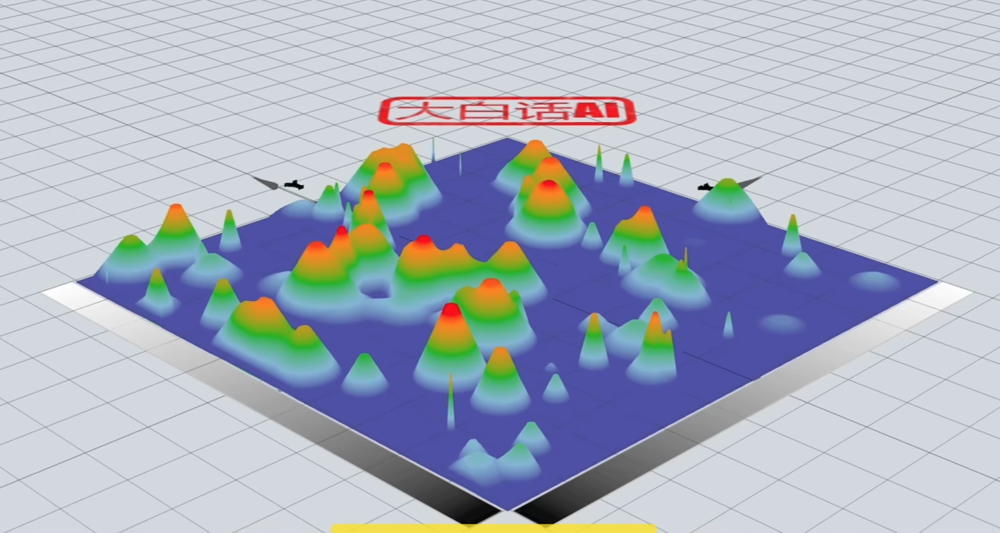

或者简单来说，某点隆起的高度越高，其对应的图片有更高的概率从抽奖箱中抽出，而对于那么毫无意义的像素组合，它们的高度为0，不可能从抽奖箱中采样得出。这就是两像素灰度图的概率空间。


如果确定左边像素的颜色值，比如x=-0.3，那么就得到了和x=-0.3平面相交的一条曲线。


该曲线就是条件概率 $P(Y|X=0.3)$ 的概率密度函数曲线，也就是在左像素颜色值为-0.3的情况下右像素的颜色概率分布。


同样的，如果确定了右像素的颜色值，比如0.1，那么就得到了和y=0.1平面相交的一条曲线。


该曲线就是条件概率 $P(X|Y=0.1)$ 的概率密度函数曲线。也就是在右像素颜色值为0.1的情况下左像素的颜色概率分布。

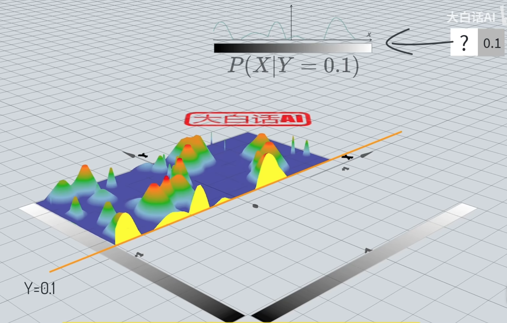

我们也可以用画等高线的方式给概率空间上色，其中越接近红色概率越高。这就是两像素灰度图的概率空间，可以用二维的热度图表示。


### 64x64RGB彩色图片概率空间

两像素灰度能传递的信息太少，那么对于一张64x64RGB彩色图片，它的概率空间是什么样子的呢？彩色图片每个像素由RGB三个通道表示，也就是每个像素需要3个维度表示，64x64的RGB彩色图片一共有4096个像素，那么其对应的概率空间维度总数不少于12288维。那是难以想象的高维空间。但是我们可以通过两像素灰度图的低维概率空间去理解高维概率空间的一些性质：
- 首先高维概率空间涵盖了所有可能的像素颜色组合。
- 其中的任意一点对应一种组合方式。
- 如果某个图像中的某个像素颜色不确定，通过周围其它像素颜色对该图像颜色进行推测时，实际上是高维概率空间中在其它维度数值确定后得到的一个超截面，表示该像素点颜色的条件概率。
- 如果某种像素组合是毫无意义图片，则其相应的概率值为0.

当从神奇抽奖箱中抽取出一张图片时，实际上是从高维概率空间采样得到其中的一个点，这样的概率空间也称为数据的真实分布。如果我们能通过神经网络拟合出数据的真实分布，就可以随机的生成图片，但是要这么做会有两个挑战：
- 复杂：真实的数据分布一定是极其复杂的
- 未知：地球上没有人知道数据的真实分布是什么

简而言之，真实的数据分布是复杂且未知的分布。那么DDPM中是如何解决这两个问题的呢？

### 复杂的数据分布

先思考这样一个问题，假设抽奖箱中有十个球，这些球的颜色要么是黑色，要么是白色。


在抽奖前我们可以控制箱子中球的颜色，比如3个黑球和7和白球。


这样从抽奖箱中随机抽取一个球，有30%的概率得到黑球，或者70%的概率得到白球。也就是说，抽奖前我们通过控制10个球的颜色，来决定随后采样得到小球颜色的概率。


那么我们应该如何控制这10个球的颜色来是得抽奖箱采样得到黑球和白球的概率分别为54%和46%呢？


如果箱子中能够放入27个黑球和23个白球，当然可以实现54%和46%的概率分布，但那需要50个球，而箱子中仅有10个球。对于这个问题我们可以这样做：

- 首先在箱子中放入4个黑球和6个白球，然后在箱子中随机抽取一个球。
- 如果得到的是黑球，则调整箱子为3个黑球和7个白球
- 如果得到的是白球，则调整箱子为7个黑球和3个白球

就这样根据第一次抽奖的结果调整抽奖箱中十个球的颜色，然后进行第二次抽取。我们用一张表格列举出所有的四种情况。
- 两次都抽取到黑球的概率为：40%x30%=12%
- 先抽取到黑球再抽取到白球的概率为：40%x70%=28%
- 两次都抽取到白球的概率为：60%x30%=18%
- 先抽取到白球再抽取到黑球的概率为：60%x70%=42%

那么：
- 第二次抽奖得到黑球的概率(边缘概率)为12%+42%=54%
- 第二次抽奖得到白球的概率(边缘概率)为28%+18%=46%


如果，我们将问题换一下：如何通过控制箱子中10个球的颜色来使得抽奖箱采样得到黑球和白球的概率分别为15.4%和84.6%呢？

我们可以根据第二次抽取得到的小球颜色来设置第三次抽奖箱中十个球的概率。
- 如果第二次抽取到了黑球，则第三次抽奖箱中放入2个黑球和8个白球
- 如果第二次抽取到了白球，则第三次抽奖箱中放入1个黑球和9个白球

那么：
- 第三次抽取到黑球的边缘概率为：10.8%+4.6% = 15.4%
- 第三次抽取到白球的边缘概率为：43.2%+41.4% = 84.6%

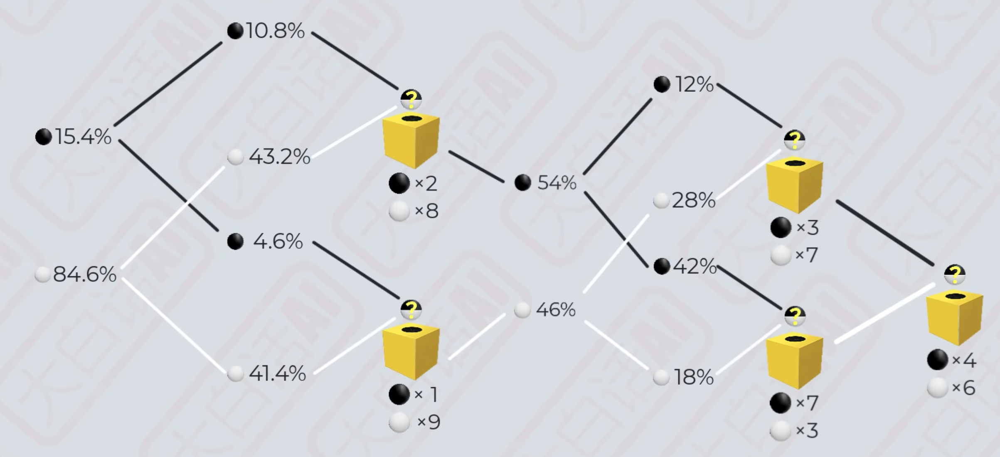

从这个例子中可以看到：

- 第二次抽奖得到小球颜色的边缘概率实际上等同于从27个黑球和23白球的抽奖箱中抽取的概率。

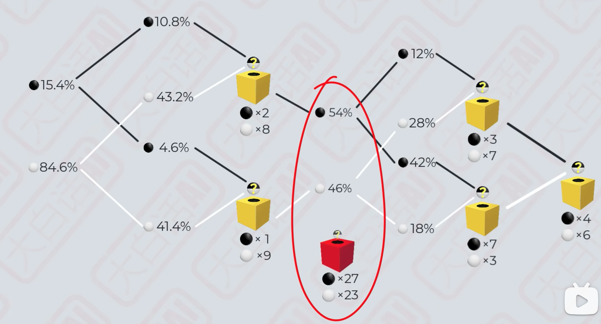

- 第三次抽奖得到小球的边缘概率实际上等同于从77个黑球和423个白球的抽奖箱中抽取的概率。


黄色抽奖箱中只有十个小球，而红色抽奖箱中的小球数量更多。也就是说，黄色抽奖箱中的概率只需要使用少数几个变量表达，也就更简单。而描述红色抽奖箱中的概率分布需要用到更多的变量表达，相较而言也就更复杂。而随着抽奖次数越多，表达边缘概率的红色抽奖箱内能放入更多的小球。也就意味着它能够用来描述越来越复杂的概率分布。至此，我们看到了一种用简单概率分布组合出复杂概率分布的方法。

首先，我们从某种简单的概率分布中采样得到某个结果，然后根据该结果重新设置黄色抽奖箱中的概率分布继续抽奖。接下来每次抽奖时黄色抽奖箱中的简单概率分布都依据上一轮抽取结果调整，换而言之，这是一种条件概率。

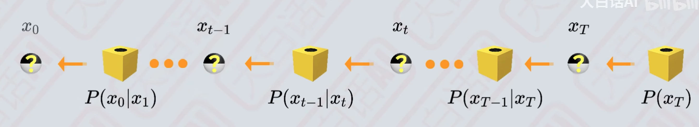

而最终得到的结果等同于从某个含有更多小球的红色抽奖箱中直接抽取。随着抽奖步数的增加代表边缘概率的红色抽奖箱内能放入更多的小球，也就是说红色抽奖箱拥有更多的变量表达更加复杂的概率分布。

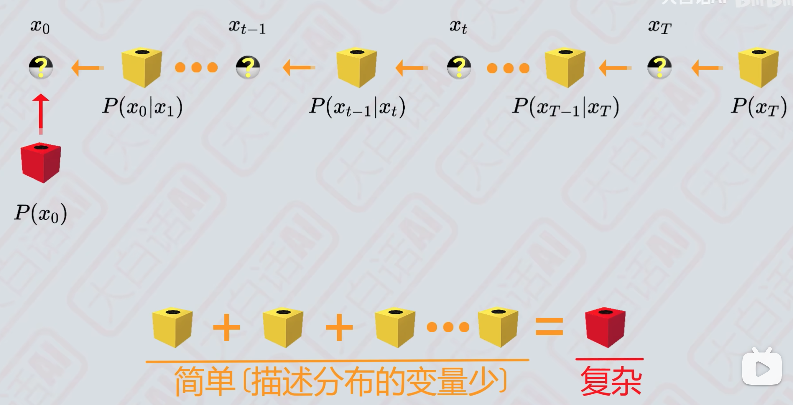

这个例子中演示了如何通过多个简单低维离散型概率组合成复杂低维离散型概率。前面提到的神奇抽奖箱中的概率属于复杂高维连续型概率，那我们可以通过成百上千个简单高维连续型概率去组合成复杂高维连续型概率，来使得红色抽奖箱内的概率分布尽量和神奇抽奖箱中的概率分布一致。

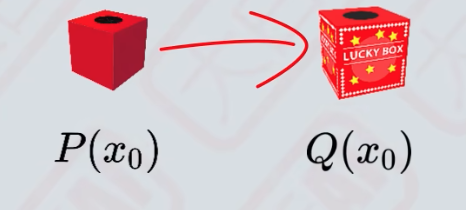

正太分布是一种简单的连续型概率，只需要使用均值 $\mu$ 和标准差 $\sigma$ 两变量就能表达。所以黄色抽奖箱内选用了高维正态分布作为其概率空间。


高维挺起来很玄幻，但是没有那么复杂。我们先看看二维正态分布是如何采样得到两像素灰度图的。

两像素灰度图分别使用两个维度表示像素的颜色值，每个维度上分别对应一个正态分布，为了简化问题，我们假设这两个正太分布它们相互独立互不影响，也就是说X的取值不会影响Y的取值。


我们首先基于x轴对应的正态分布进行随机采样，确定x轴上随机变量的取值位置，即左像素的颜色值。


然后再基于y轴对应的正态分布进行随机采样，确定y轴上随机变量的取值位置，即右像素的颜色值。


这样就得到了一个交点，也就是一张两像素的图片。


正态分布的特点是越靠近均值 $\mu$ ，相应随机变量取值概率越高。所以这两个正态分布均值的交点处概率密度最大。正态分布的概率从均值往两侧逐步减小。所以围绕均值交点向外侧概率密度也是逐步减小的。

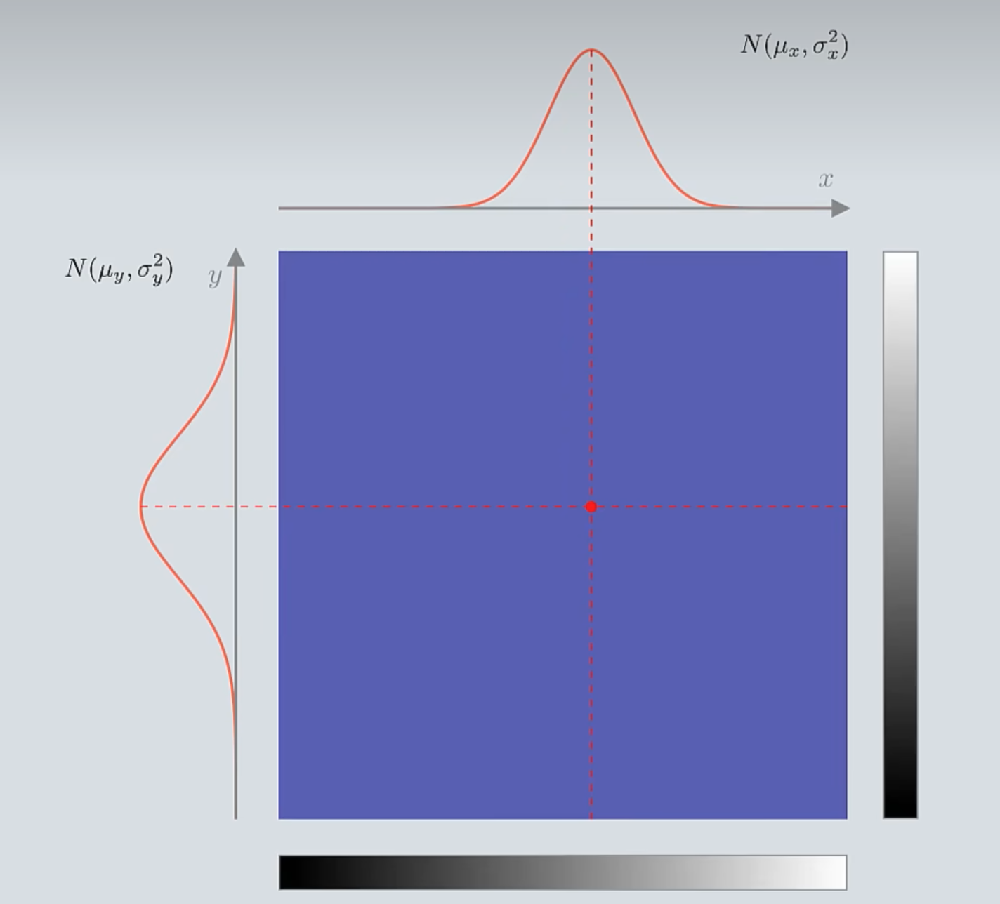

我们还可以使用热度图来表示二维空间内的概率分布，其中红色区域的概率密度最大，然后逐步向周围减小。可以看出热度图上是一个边界模糊的椭圆。椭圆的长短轴分别和x轴和y轴上的正态分布的标准差 $\sigma$ 成正比。

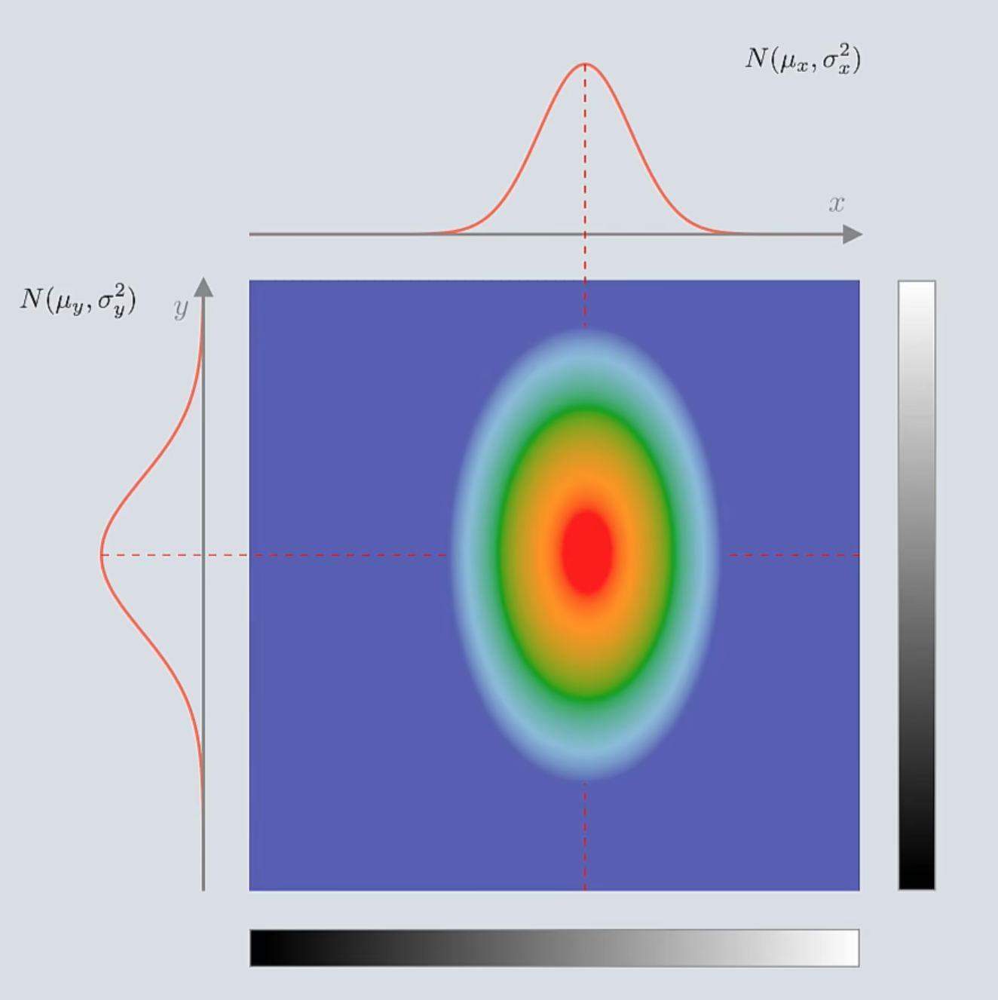

当正态分布的标准差 $\sigma$ 越小，椭圆的轴越短。


当正态分布的标准差 $\sigma$ 越大，椭圆的轴越长。


如果两个正态分布的标准差 $\sigma$ 一致，那么得到的热度图是一个边界模糊的正圆。


圆心的概率密度最大，它的位置由x轴和y轴上的正态分布的均值 $\mu$ 确定。


这个例子是仅有两个维度的情况，如果我们在此基础上增加第三个维度，且第三个维度标准差 $\sigma$ 和前面两个维度一致，那么热度图又会变成什么样呢？

在所有维度标准差 $\sigma$ 相同的情况下，三维正态分布的热度图是一个边界模糊的球形。球心的概率密度最高，距离球心越远概率密度越低。标准差 $\sigma$ 确定了球的半径，或者说概率密度的集中趋势。


对于64x64的RGB彩色图像所属12288维的概率空间，在每个维度都对应了一个正态分布，这些正态分布互不影响且标准差 $\sigma$ 相同，那么它对应的热度图是一个12288维的超球体。该超球体的球心坐标既是12288个正态分布的均值。


高维虽然难以想象，但它的性质和低维是一样的。即：
- 概率空间涵盖了所有可能的像素组合
- 空间中任意一点对应了一张图片
- 采样围绕着球心进行，越靠近球心的图片被采样得到的概率越大。
- 标准差 $\sigma$ 控制着超球体的半径，也就是选取图片的大致范围。
- 标准差 $\sigma$ 越小，超球体的半径也就越小，取值越集中；反之亦然。

每个黄色抽奖箱中都有这样一个超球体，控制超球体的球心以及半径就能控制黄色抽奖箱的概率分布。在逐步采样的过程中我们希望得到结果越来越确定，所以第一次抽奖的黄色抽奖箱内超球体的半径最大，而后的每次抽奖超球体的半径越来越小逐渐接近于零。

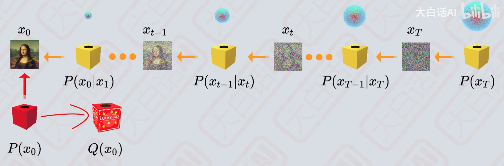

在DDPM中每个黄色抽奖箱中超球体的标准差 $\sigma$ 是预设值，这些超球体的半径都是已知且固定的。

那么就只需要确定球心的位置，也就是正态分布的均值 $\mu$ 。对于第一次抽奖的黄色抽奖箱，它的超球体球心位置位于概率空间的零点。而后的黄色抽奖箱内的超球体的球心位置都由上一轮抽取结果确定，也就是条件概率 $P(x_{t-1}|x_t)$ ，所以，我们引入神经网络来控制黄色抽奖箱内超球体的位置。

至此，我们解决了第一个问题，我们有能力通过成百上千个黄色抽奖箱中的简单概率分布来实现复杂的概率分布。接下来的目标是如果通过控制黄色抽奖箱中超球体球心的位置使得组合出来的红色抽奖箱内概率分布与神奇抽奖箱中的概率分布尽量一致。或者说通过神经网络输出 $P(x_{t-1}|x_t)$ 的均值，使得边缘概率 $P(x_0)$ 拟合数据分布 $Q(x_0)$

## 重新审视加噪和去噪公式

在我们有了一些关于正态分布的知识后，让我们再来重新审视一下加噪和去噪过程。

### 加噪过程
下面是加噪过程得出的重要推导公式：


如果我们使用重参数化技巧，那么它可以使用如下的公式来表达：

$$x_t \sim N(\sqrt{\overline{\alpha}}x_0, 1 - \overline{\alpha})$$

它等同于 $x_t$ 采样自一个均值为 $\mu = \sqrt{\overline{\alpha}}x_0$ ，标准差 $\sigma = \sqrt{1 - \overline{\alpha}}$ 的正态分布。

我们知道在加噪过程中，$\beta$ 是预设值，它的值随着时刻 $t$ 的增大而增大，而 $\alpha = 1 - \beta$ 。这就意味着随着时刻 $t$ 的增大，这个正态分布均值 $\mu$ 会逐渐减小，直到变成0，而标准差 $\sigma$ 会逐渐增大，直到变成1。

### 去噪过程

下面是去噪过程得出来的重要推导公式：


而 $\sigma_t$ 定义如下：
$$\sigma_t = \sqrt{\frac{(1 - \alpha_t)(1 -  \overline{\alpha}_{t - 1})}{ 1 - \overline{\alpha}_t}}$$

如果我们使用重参数化技巧，那么它可以使用如下的公式来表达：

$$x_{t-1} \sim N(\frac{1}{\sqrt{\alpha_t}}(x_t - \frac{1 - a_t}{\sqrt{1 - \overline{\alpha_t}}}\epsilon_{\theta}(x_t, t)), \sigma_t^2)$$

它等同于 $x_{t-1}$ 采样自一个均值为 $\mu = \frac{1}{\sqrt{\alpha_t}}(x_t - \frac{1 - \alpha_t}{\sqrt{1 - \overline{\alpha_t}}}\epsilon_{\theta}(x_t, t))$ ，标准差 $\sigma = \sigma_t$ 的正态分布。

我们知道在去噪过程中，时刻 $t$ 是由大变小。也就意味着 $\beta$ 会越来越小，这就意味着去噪过程中的正态分布的标准差 $\sigma$ 会越来越小，但是 $\sigma$ 可以通过 $\beta$ 直接算出，所以说去噪过程中的正太分布的标准差在每个时刻是 $t$ 是固定的。


