# 如何使用去噪扩散概率模型(DDPM)随机生成动漫头像

## 扩散模型的本质

想象一下有这么一个神秘的箱子，我们可以从箱子中抽取出一张张的图片，那么这个箱子中的抽取出来的图片遵循的概率分布是什么样的？

// 图片: 神秘抽奖箱子

首先来看一下最简单的情况，假设从箱子中抽取出的图片是只有两个像素的灰度图片。如下图所示只有左右两个像素的图片：

既然是灰度图，那么它的像素值取值范围就只能在[0, 255]之间，我们将其映射到[-1, 1]之间，-1表示黑色，1表示白色。

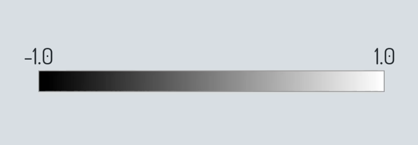

然后，使用x轴表示左边的像素值，使用y轴表示右边的像素值。

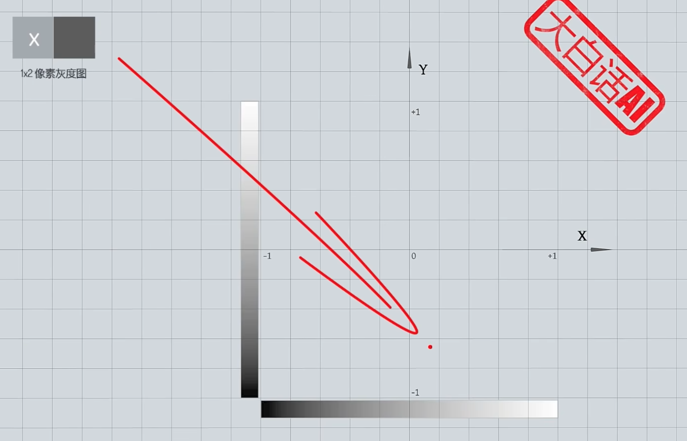

那么，图中蓝色区域内的任意一点代表一张两像素的灰度图，换而言之，蓝色区域包含了两像素灰度图所有可能的像素颜色组合。

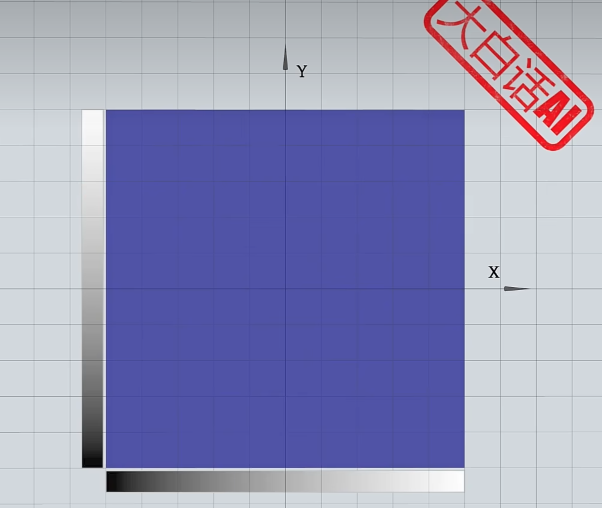

接着，用z轴的位置表示对应图片从抽奖箱中采样出来的概率密度

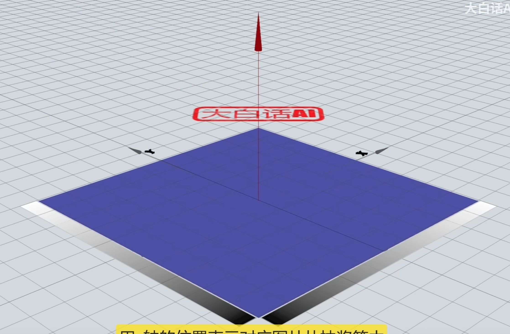

这样，平面就变成了曲面，曲面和xy平面之间合围的体积表示概率

或者简单来说，某点隆起的高度越高，其对应的图片有更高的概率从抽奖箱中抽出，而对于那么毫无意义的像素组合，它们的高度为0，不可能从抽奖箱中采样得出。这就是两像素灰度图的概率空间。

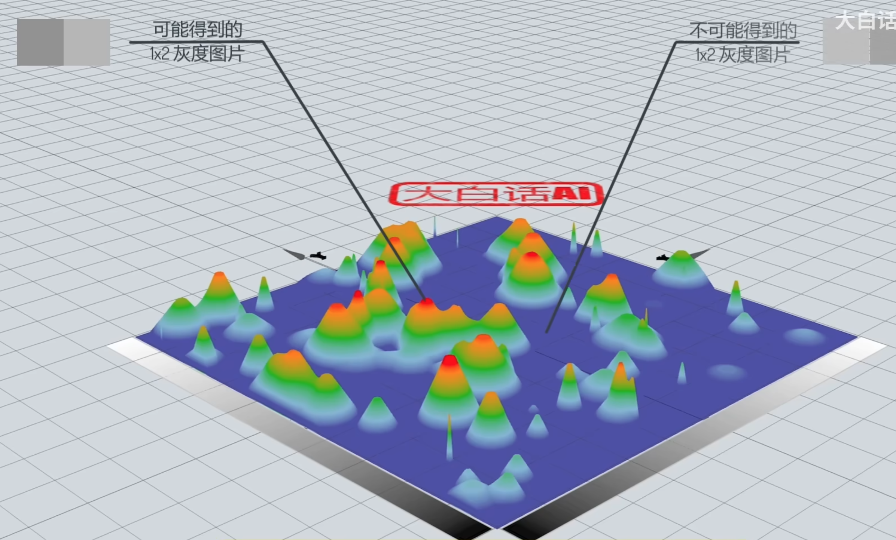

如果确定左边像素的颜色值，比如x=-0.3，那么就得到了和x=-0.3平面相交的一条曲线。

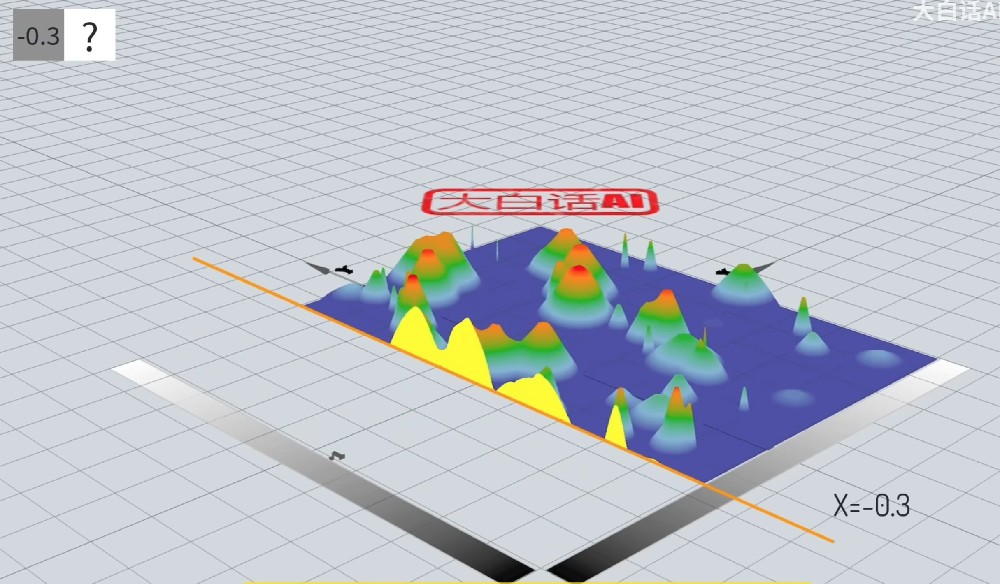

该曲线就是条件概率 $P(Y|X=0.3)$ 的概率密度函数曲线，也就是在左像素颜色值为-0.3的情况下右像素的颜色概率分布。

同样的，如果确定了右像素的颜色值，比如0.1，那么就得到了和y=0.1平面相交的一条曲线。

该曲线就是条件概率 $P(X|Y=0.1)$ 的概率密度函数曲线。也就是在右像素颜色值为0.1的情况下左像素的颜色概率分布。

我们也可以用画等高线的方式给概率空间上色，其中越接近红色概率越高。这就是两像素灰度图的概率空间，可以用二维的热度图表示。

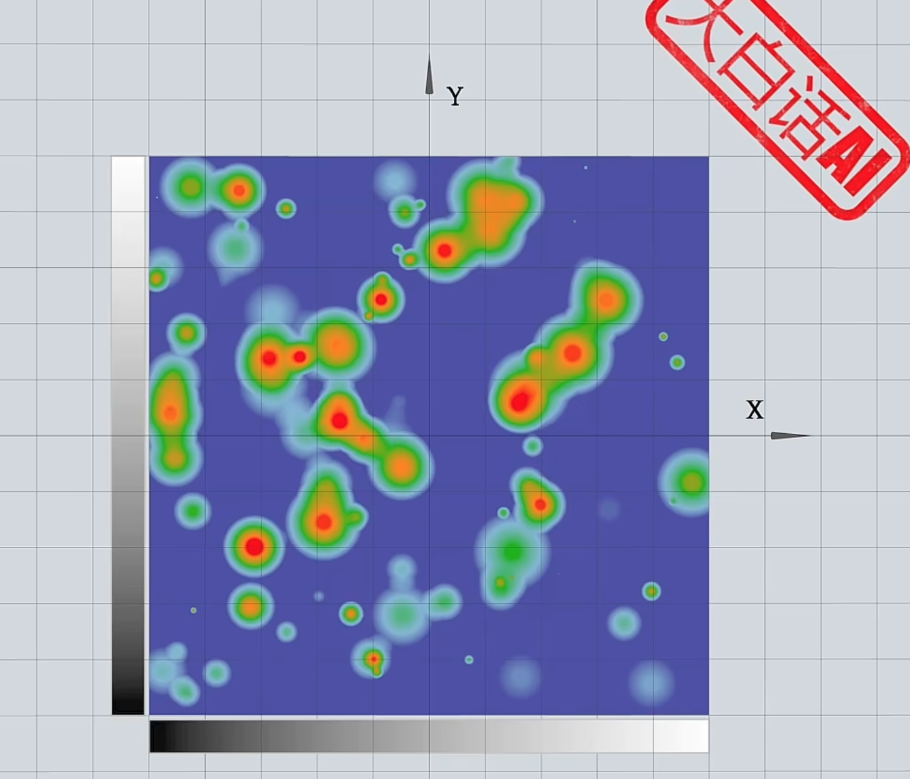

两像素灰度能传递的信息太少，那么对于一张64x64RGB彩色图片，它的概率空间是什么样子的呢？彩色图片每个像素由RGB三个通道表示，也就是每个像素需要3个维度表示，64x64的RGB彩色图片一共有4096个像素，那么其对应的概率空间维度总数不少于12288维。那是难以想象的高维空间。但是我们可以通过两像素灰度图的低维概率空间去理解高维概率空间的一些性质：
- 首先高维概率空间涵盖了所有可能的像素颜色组合。
- 其中的任意一点对应一种组合方式。
- 如果某个图像中的某个像素颜色不确定，通过周围其它像素颜色对该图像颜色进行推测时，实际上是高维概率空间中在其它维度数值确定后得到的一个超截面，表示该像素点颜色的条件概率。
- 如果某种像素组合是毫无意义图片，则其相应的概率值为0.

当从神奇抽奖箱中抽取出一张图片时，实际上是从高维概率空间采样得到其中的一个点，这样的概率空间也称为数据的真实分布。如果我们能通过神经网络拟合出数据的真实分布，就可以随机的生成图片，但是要这么做会有两个挑战：
- 复杂：真实的数据分布一定是极其复杂的
- 未知：地球上没有人知道数据的真实分布是什么

简而言之，真实的数据分布是复杂且未知的分布。那么DDPM中是如何解决这两个问题的呢？

### 复杂

先思考这样一个问题，假设抽奖箱中有十个球，这些球的颜色要么是黑色，要么是白色。

在抽奖前我们可以控制箱子中球的颜色，比如3个黑球和7和白球。

这样从抽奖箱中随机抽取一个球，有30%的概率得到黑球，或者70%的概率得到白球。也就是说，抽奖前我们通过控制10个球的颜色，来决定随后采样得到小球颜色的概率。

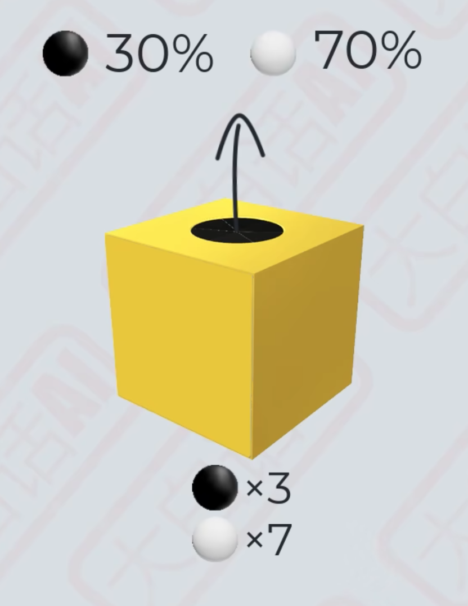

那么我们应该如何控制这10个球的颜色来是得抽奖箱采样得到黑球和白球的概率分别为54%和46%呢？

如果箱子中能够放入27个黑球和23个白球，当然可以实现54%和46%的概率分布，但那需要50个球，而箱子中仅有10个球。对于这个问题我们可以这样做：

- 首先在箱子中放入4个黑球和6个白球，然后在箱子中随机抽取一个球。
- 如果得到的是黑球，则调整箱子为3个黑球和7个白球
- 如果得到的是白球，则调整箱子为7个黑球和3个白球

就这样根据第一次抽奖的结果调整抽奖箱中十个球的颜色，然后进行第二次抽取。我们用一张表格列举出所有的四种情况。
- 两次都抽取到黑球的概率为：40%x30%=12%
- 先抽取到黑球再抽取到白球的概率为：40%x70%=28%
- 两次都抽取到白球的概率为：60%x30%=18%
- 先抽取到白球再抽取到黑球的概率为：60%x70%=42%

那么：
- 第二次抽奖得到黑球的概率(边缘概率)为12%+42%=54%
- 第二次抽奖得到白球的概率(边缘概率)为28%+18%=46%

如果，我们将问题换一下：如何通过控制箱子中10个球的颜色来使得抽奖箱采样得到黑球和白球的概率分别为15.4%和84.6%呢？

我们可以根据第二次抽取得到的小球颜色来设置第三次抽奖箱中十个球的概率。
- 如果第二次抽取到了黑球，则第三次抽奖箱中放入2个黑球和8个白球
- 如果第二次抽取到了白球，则第三次抽奖箱中放入1个黑球和9个白球

那么：
- 第三次抽取到黑球的边缘概率为：10.8%+4.6% = 15.4%
- 第三次抽取到白球的边缘概率为：43.2%+41.4% = 84.6%

从这个例子中可以看到：

- 第二次抽奖得到小球颜色的边缘概率实际上等同于从27个黑球和23白球的抽奖箱中抽取的概率。

- 第三次抽奖得到小球的边缘概率实际上等同于从77个黑球和423个白球的抽奖箱中抽取的概率。

黄色抽奖箱中只有十个小球，而红色抽奖箱中的小球数量更多。也就是说，黄色抽奖箱中的概率只需要使用少数几个变量表达，也就更简单。而描述红色抽奖箱中的概率分布需要用到更多的变量表达，相较而言也就更复杂。而随着抽奖次数越多，表达边缘概率的红色抽奖箱内能放入更多的小球。也就意味着它能够用来描述越来越复杂的概率分布。至此，我们看到了一种用简单概率分布组合出复杂概率分布的方法。

首先，我们从某种简单的概率分布中采样得到某个结果，然后根据改结果重新设置黄色抽奖箱中的概率分布继续抽奖。接下来每次抽奖时黄色抽奖箱中的简单概率分布都依据上一轮抽取结果调整，换而言之，这是一种条件概率。

而最终得到的结果等同于从某个含有更多小球的红色抽奖箱中直接抽取。随着抽奖步数的增加代表边缘概率的红色抽奖箱内能放入更多的小球，也就是说红色抽奖箱拥有更多的变量表达更加复杂的概率分布。

这个例子中演示了如何通过多个简单低维离散型概率组合成复杂低维离散型概率。前面提到的神奇抽奖箱中的概率属于复杂高维连续型概率，那我们可以通过成百上千个简单高维连续型概率去组合成复杂高维连续型概率，来使得红色抽奖箱内的概率分布尽量和神奇抽奖箱中的概率分布一致。

正太分布是一种简单的连续型概率，只需要使用均值 $\mu$ 和标准差 $\sigma$ 两变量就能表达。所以黄色抽奖箱内选用了高维正态分布作为其概率空间。

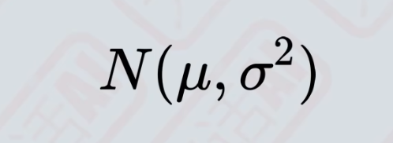

高维挺起来很玄幻，但是没有那么复杂。我们先看看二维正态分布是如何采样得到两像素灰度图的。

两像素灰度图分别使用两个维度表示像素的颜色值，每个维度上分别对应一个正态分布，它们相互独立互不影响。

我们首先基于x轴对应的正态分布进行随机采样，确定x轴上随机变量的取值位置，即左像素的颜色值。

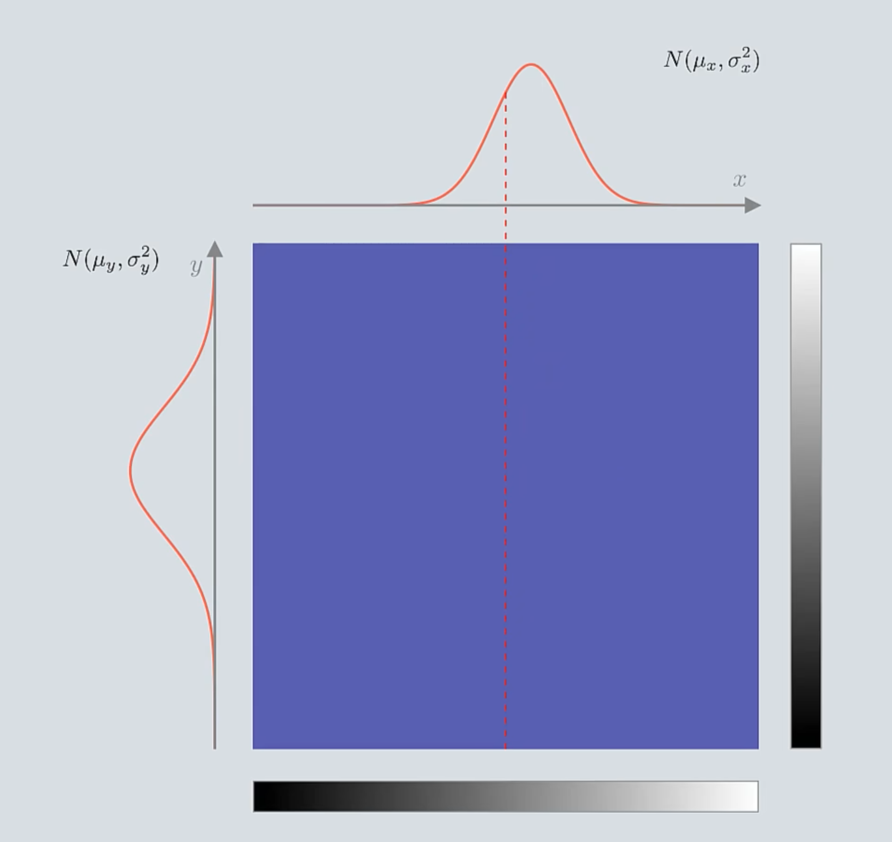

然后再基于y轴对应的正态分布进行随机采样，确定y轴上随机变量的取值位置，即右像素的颜色值。

这样就得到了一个交点，也就是一张两像素的图片。

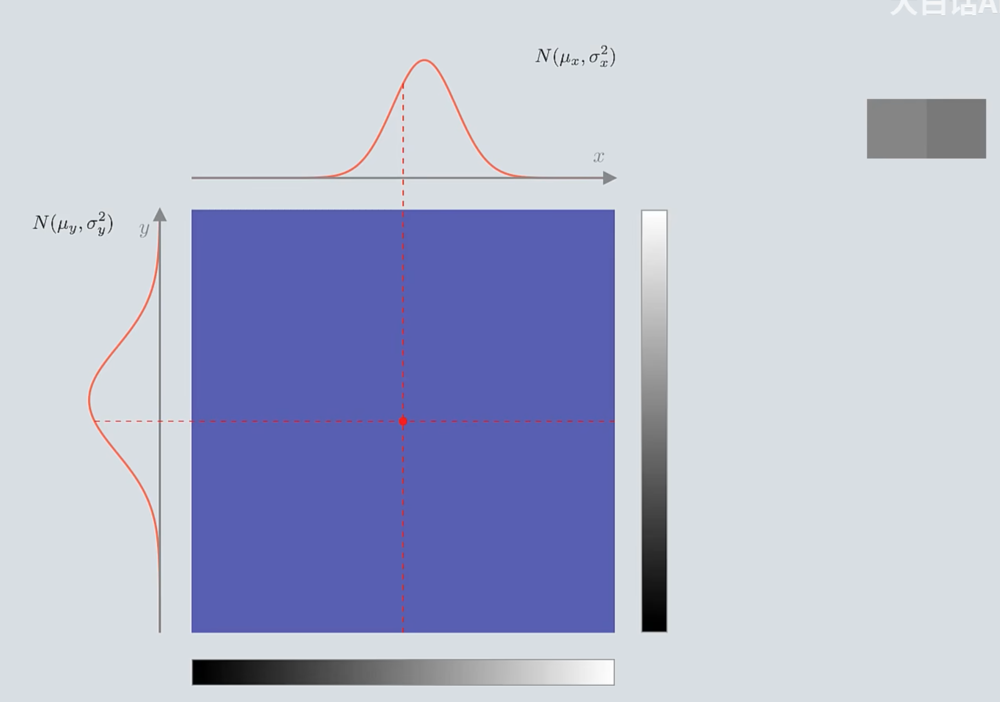

正态分布的特点是越靠近均值 $\mu$ ，相应随机变量取值概率越高。所以这两个正态分布均值的交点处概率密度最大。正态分布的概率从均值往两侧逐步减小。所以围绕均值交点向外侧概率密度也是逐步减小的。

我们还可以使用热度图来表示二维空间内的概率分布，其中红色区域的概率密度最大，然后逐步向周围减小。可以看出热度图上是一个边界模糊的椭圆。椭圆的长短轴分别和x轴和y轴上的正态分布的标准差 $\sigma$ 成正比。

当正态分布的标准差 $\sigma$ 越小，椭圆的轴越短。

当正态分布的标准差 $\sigma$ 越大，椭圆的轴越长。

如果两个正态分布的标准差 $\sigma$ 一致，那么得到的热度图是一个边界模糊的正圆。

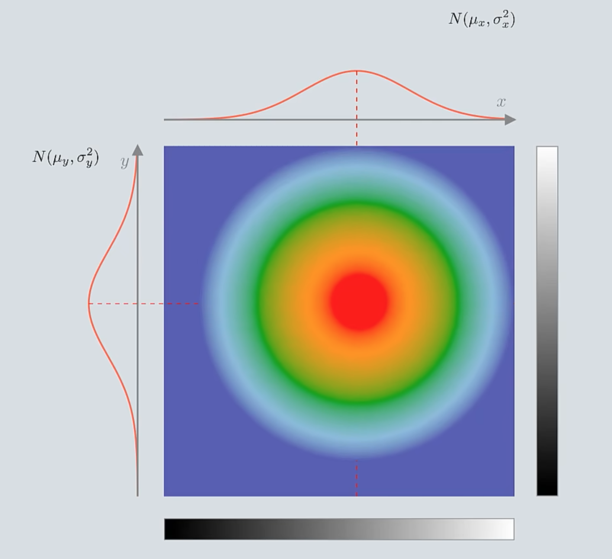

圆心的概率密度最大，它的位置由x轴和y轴上的正态分布的均值 $\mu$ 确定。

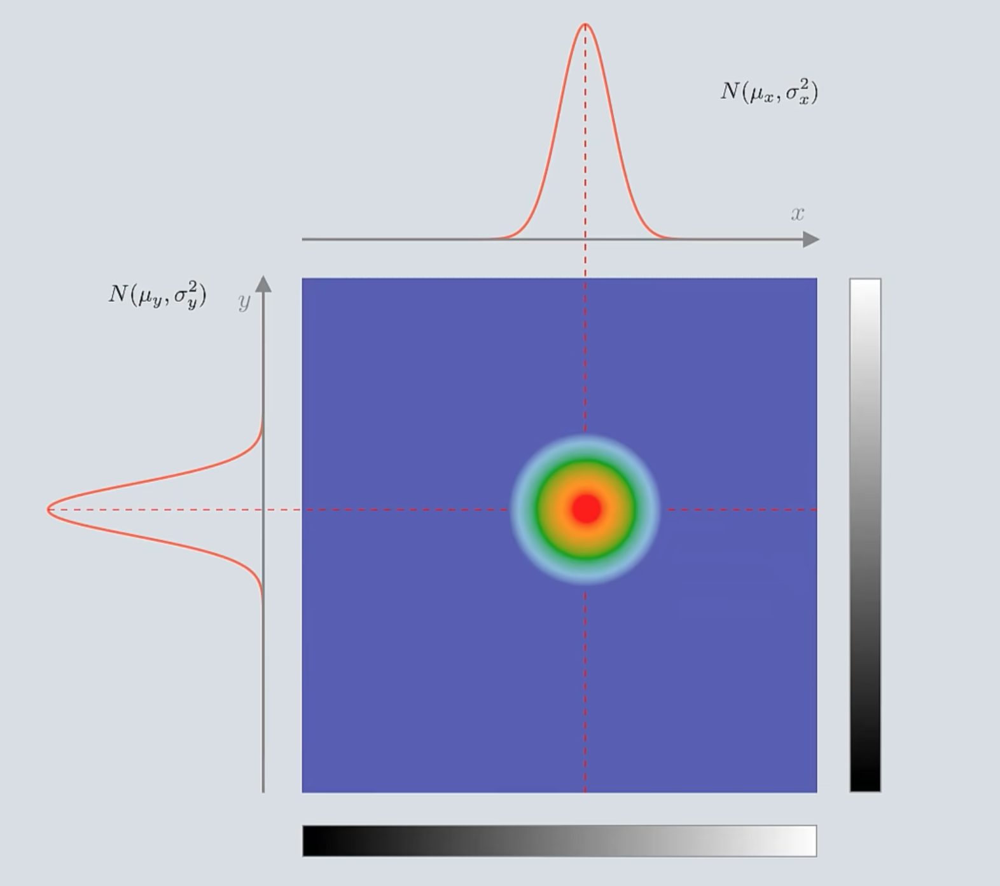

这个例子是仅有两个维度的情况，如果我们在此基础上增加第三个维度，且第三个维度标准差 $\sigma$ 和前面两个维度一致，那么热度图又会变成什么样呢？

在所有维度标准差 $\sigma$ 相同的情况下，三维正态分布的热度图是一个边界模糊的球形。球心的概率密度最高，距离球心越远概率密度越低。标准差 $\sigma$ 确定了球的半径，或者说概率密度的集中趋势。

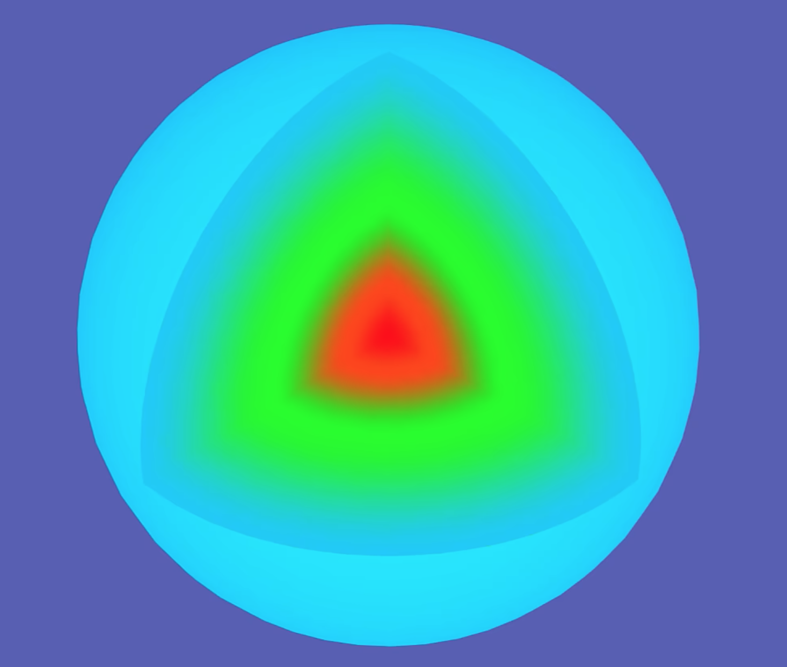

对于64x64的RGB彩色图像所属12288维的概率空间，在每个维度都对应了一个正态分布，这些正态分布互不影响且标准差 $\sigma$ 相同，那么它对应的热度图是一个12288维的超球体。该超球体的球心坐标既是12288个正态分布的均值。

高维虽然难以想象，但它的性质和低维是一样的。即：
- 概率空间涵盖了所有可能的像素组合
- 空间中任意一点对应了一张图片
- 采样围绕着球心进行，越靠近球心的图片被采样得到的概率越大。
- 标准差 $\sigma$ 控制着超球体的半径，也就是选取图片的大致范围。
- 标准差 $\sigma$ 越小，超球体的半径也就越小，取值越集中；反之亦然。

每个黄色抽奖箱中都有这样一个超球体，控制超球体的球心以及半径就能控制黄色抽奖箱的概率分布。在逐步采样的过程中我们希望得到结果越来越确定，所以第一次抽奖的黄色抽奖箱内超球体的半径最大，而后的每次抽奖超球体的半径越来越小逐渐接近于零。

在DDPM中每个黄色抽奖箱中超球体的标准差 $\sigma$ 是预设值，这些超球体的半径都是已知且固定的。

那么就只需要确定球心的位置，也就是正态分布的均值 $\mu$ 。对于第一次抽奖的黄色抽奖箱，它的超球体球心位置位于概率空间的零点。而后的黄色抽奖箱内的超球体的球心位置都由上一轮抽取结果确定，也就是条件概率 $P(x_{t-1}|x_t)$ ，所以，我们引入神经网络来控制黄色抽奖箱内超球体的位置。

至此，我们解决了第一个问题，我们有能力通过成百上千个黄色抽奖箱中的简单概率分布来实现复杂的概率分布。接下来的目标是如果通过控制黄色抽奖箱中超球体球心的位置使得组合出来的红色抽奖箱内概率分布与神奇抽奖箱中的概率分布尽量一致。或者说通过神经网络输出 $P(x_{t-1}|x_t)$ 的均值，使得边缘概率 $P(x_0)$ 拟合数据分布 $Q(x_0)$

### 未知
TODO

## 图像生成的本质
TODO