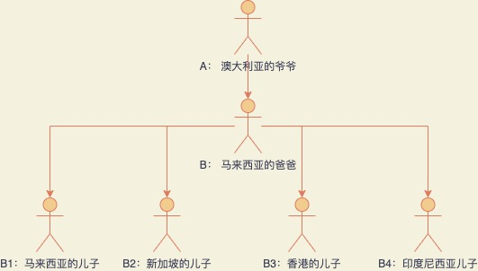
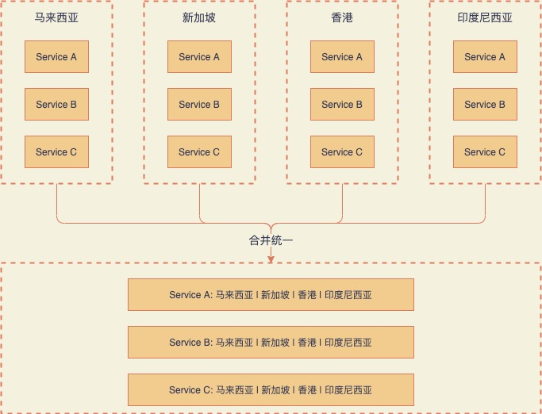
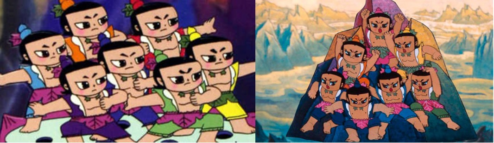
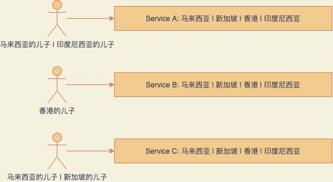
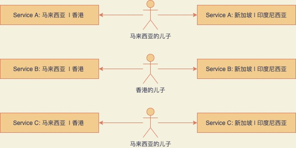

# 并购和分割中的一些思考

我在thoughtworks工作的几年里待过的几个项目最终都被客户卖出，现在所在的项目也同样正在被客户售卖，但这个项目比较特殊，其中有些故事和教训想分享给大家。

## 背景

几年前，我所在项目的客户公司（简称A公司，澳大利亚的爷爷）收购了一家东南亚公司（简称B公司，马来西亚的爸爸），A公司和B公司服务的领域都是房地产在线租售，不同之处在于A公司的经营范围在澳大利亚，而B公司的经营范围在东南亚。B公司在不同的区域（包括：中国香港、新加坡、马来西亚、印度尼西亚和泰国）拥有不同品牌的房地产在线租售站点，这些子品牌也都是通过并购合并到B公司，B公司收购这些公司后将其独立运营，所以不同的品牌实质上也是独立的公司。它们之间的关系如下图：

A公司收购B公司后同样决定将其独立运营，但A公司发现B公司的各个子品牌有诸多问题，比如：
- 各个子品牌的用户体验也不一致。
- 各个子品牌的UI老旧。
- 各个子品牌的技术栈和架构完全不同。
- 各个子品牌的人员之间存在重复。

所以，A公司空降CTO到B公司后，就开始大力搞建设，当时我们的口号是：One team, One dream。

## 同一个梦

One dream是啥呢？主要有这两点：

- 更好和统一的用户体验。
- 先进和统一的技术和架构。

经过一番讨论，最终的方向就是：
- 对于用户可见的系统，保持每个品牌服务独立部署和运行，但是需要使用一个代码库通过不同的配置来构建不同品牌的服务。
- 对于用户不可见的服务，使用一个代码库构来建一个独立运行的服务来支持不同品牌的业务需求。

简而言之，四个品牌的技术人员需要工作在同一套代码库中。同时，而这些系统架构的变化方向也很大的影响了团队组织结构的变化。

<!--  -->

## 同一家人

由于系统架构的变化，原来只耕耘自己家一亩三分地的孙子们被爷爷召集了起来，并被告知一根筷子很容易被折断，十根筷子很难被折断，你们这四根合在一起...

傻孩子们好像也没有太明白四根一起有多好的道理，但他们相信爷爷和爸爸肯定是对的，于是合并在了一起。

<!--  -->

但是事情并没有完全向爷爷和爸爸预想中的进行，一段时间之后，他们发现每个孩子都有他们自己的个性，他们中有些人还是喜欢独自干一些事情。所以经过一段时间后团队组织结构变成如下图所示的结构：

可以看到有些事情由某个孩子一个人所管理，不过这看起来似乎也没有什么问题，毕竟还是一家人嘛。

## 来自有钱爷爷的关怀

说起这个爷爷那是大城市里来的，有钱不说还非常有文化，对孙子们是各种教育和指引，同时还带来了他自己发明的一些先进工具，这些工具都是爷爷的私家神器，外面市场是找不到的，更别说有外面会有人会使用了，所以爷爷就亲自教孙子们怎么使用这些工具。这些孙子们以前哪用过这等好东西啊，用了之后都爱的不行不行的。

## 原来自己不是亲孙子

孙子们一边努力干活，一边向爷爷学习先进技术，日子过的也是快活，但是新冠疫情的到来改变了这一切。新冠疫情影响了爷爷在城市的里事业，爷爷还有他城市里的娃娃要养，迫不得已爷爷只能把一些孙子卖给其他人。这时候孙子们才渐渐意识到一个道理：被买来的孙子，很可能会再次被卖掉。

## 新爸爸C的出现

爷爷为孙子们找来了新爸爸C，并将印度尼西亚和新加坡的两个孙子卖给了他。但爸爸C只是想要这两个儿子所经营的业务，他的计划是将两个儿子所有的业务和数据都迁移到自己的系统，然后抛弃这两个儿子。听到这，这两儿子都跑了。于是爸爸C要求A爷爷和B爸爸：在他完成迁移之前，A爷爷和B爸爸需要继续维护印度尼西亚和新加坡的业务。

由于之前马来西亚，新加坡，香港和印度尼西亚的系统都已经被合并在了一起，现在要分离就没有那么容易了，需要将整体服务拷贝给爸爸C，不过好在留下来的孩子们对于各个服务都有接触，所以留下来的孩子来帮爸爸C维护系统也不是那么难。于是团队组织结构又变成如下图所示的结构：

## 新爸爸D的出现

留下来的孙子们以为爷爷爱他们不舍得卖他们，没想到好景不长，爷爷又开始给孙子们找新爸爸。孙子们又被卖了，但是这次只卖了一个强壮一些的马来西亚的孙子，留下这个瘦弱的香港的孙子没人要，有些尴尬。

新爸爸D不错，他购买马来西亚的孙子之后，既保留他的人也保留他的业务，让他自由飞翔。但问题来了：
- 这些系统都依赖了爷爷自己发明的工具和服务，以后没了爷爷的维护和支持，万一工具和服务有问题或者想要升级功能，那基本是没戏了。所以也只能咬着牙把这些工具都替换掉，真是一夜回到解放前。
- 马来西亚的儿子和香港的儿子都只负责了整个系统的部分子系统，他们之间对于彼此的服务都几乎不了解。一旦分割两个人，他们就需要在短时间内迅速的去接下对方所负责的所有的业务和系统，这是一个非常大的挑战。
- 由于之前的合并，所有系统的代码都混杂了多个品牌存在的不同业务的逻辑，这对于后期的维护也是很大的挑战。

## 一些思考

从开始不顾一切的合并再到后面想方设法的分离，整个过程看起来很荒谬。但如果时间可以倒流到开始的时候，我又能有什么样的方法和建议呢？我想可能有这几点：

- 并购和分割现在已经是常态，被买来的干儿子再次被卖出的几率是非常大的，我想这些对CTO级别的人肯定也是考虑到的，但他们可能没有想到孙子们是一个一个被卖掉的。所以对于独立运营的品牌，保持其相对的独立性是非常重要的。

- 对于一些内部工具的使用也要有足够的考量。比如如果出现分割的情况是否能继续方便的使用这些工具，如果不能那么替换这些工具需要多大的代价。

- 技术团队端到端的能力是非常重要的，对于这种可能会将品牌和团队同时打包卖出的更为重要，否则会花费很大的力气做交接工作。

- 技术团队喜欢将一切可重用的东西重用，比如各个品牌代码的合并。但有时候适当的重复是有必要的，它能使代码逻辑更加简单，明确和易于理解。尤其是对这种不稳定的并购关系中选择合并代码需要慎重考虑。

## 最后

爷爷还在为最后一个孙子找新爸爸，孙子也在想法子切断一切依赖爷爷的工具和服务，这样能让被卖的过程简单一些。
