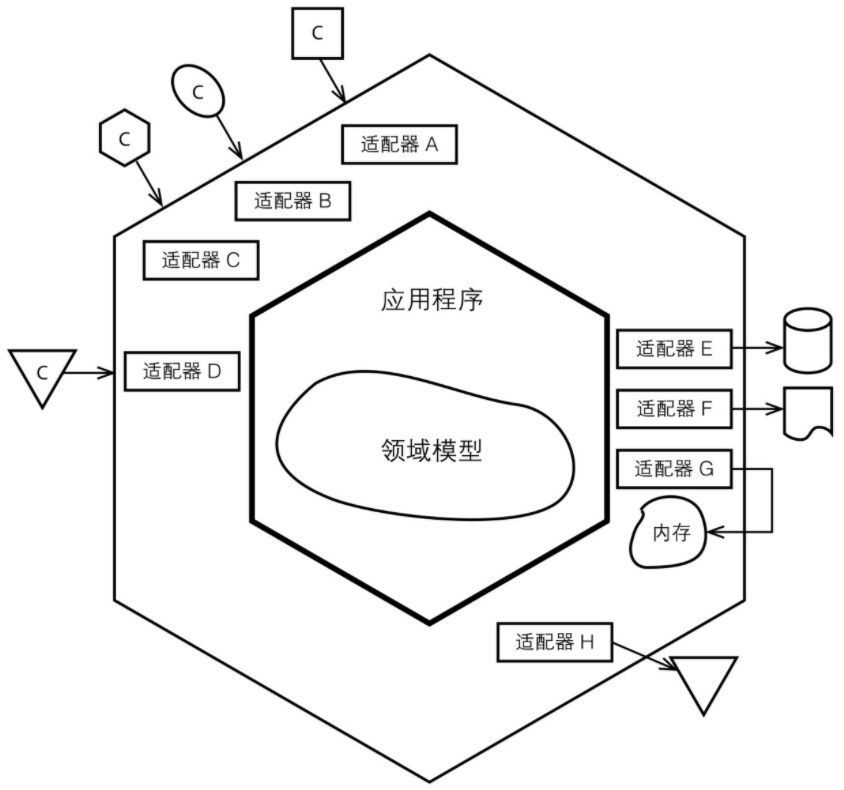

# Hexagonal architecture

## What is Hexagonal architecture?

Hexagonal Architecture is also known as Ports and Adapters Architecture. Many people think the name Ports and Adapter Architecture is more appropriate than Hexagonal Architecture, but the intent of using Hexagonal Architecture is to visually highlight the following points:

- There are two primary areas, the outside and inside.
- The similarity of a group of Ports, each of the hexagon's sides represents a different kinds of Port, for either input or output.
- Present a certain number of different groups of Port.

It is not because of how important the number "six" is, but rather to allow the people doing the drawing to have room to insert ports and adapters as they need, not being constrained by a one-dimensional layered drawing. The term Hexagonal Architecture comes from this visual effect.




## The motivation of Hexagonal architecture

In Hexagonal architecture, when a client request arrives, an adapter based on a specific technology will convert the client input and adapt it to a port of inner hexagonal, which will then invoke an operation of the application, while the app knows nothing about the input device. For output, the application sends the information through a port to the adapter, which in turn converts the output into an appropriate output signal for the specific technology of the information recipient. During the input and output, the application only interacts with the corresponding adapter and doesn't know the specific technology on the other side of the adapter.

The intent is to allow applications to be driven in a consistent manner by users, programs, automated tests, batch script, etc. Development and test can be isolated from the actual running devices and databases.

## Two areas of Hexagonal architecture

In a traditional layered architecture, all our dependencies would point in one direction, each layer above would depend on the layer below itself, and we would look at each layer in a top-down order. However, the hexagonal architecture advocates a new perspective to look at the entire system. There are two areas in the hexagonal architecture: the outer area and the inner area. The outer area handles the interaction with external entities, and the inner area handles business. And all dependencies point to the central area.

### The outer area

The outer area is the outer hexagonal area where different customers can submit input. Each type of client has its own adapter, which is used to convert client input into the input understood by the inner area of the program.

### The inner area

The inner area is the inner hexagonal area, the inner area contains the application and the domain model, and the application is the direct client of the domain model. The boundary of the inner hexagon is also the boundary of application, as well as the use case or user story boundary. When using the hexagonal architecture, we should design the application in the inner area according to the functional requirements, instead of according to the input and output mechanism requested by the customer.

### How outer area and inner area communicate？

Each different side of the hexagon represents a different type of port, which either handles input or output. The ports of the inner hexagon are the only way in which the outer area communicates with the inner area in the hexagonal architecture. Users can insert the corresponding adapter into this port according to different technical implementations, the outer area and inner area are decoupled in this way.

### Rules that must be followed for hexagonal architecture

**Code related to the inner area cannot be leaked to the outer area**. That is, the business logic code cannot be leaked to the place where it interacts with external entities. If the business logic is leaked to the outside, there will be a situation where the inner area depends on the outer area, that means there is no guaarantee that the outer area can be replaced.

## What is the Port?

Here's how the book Implementing Domain-Driven-Design describe the ports of the hexagonal architecture.

> There is not a strict definition of what a Port means, making it a flexible concept. We actually normally don't implement the Ports ourselves. Think of a Port as HTTP and the Adapter as a Java Servlet or JAX-RS annotated class that receives method invocations from a container or framework. Or we might create a message listener for for NServiceBUs or RabbitMQ. In that case the Port is more or less the messaging mechansim, and the Adapter is the message listener, because it is the responsibility of the message listener to grab data from the message and translate it into parameters suitable to pass into the Application's API.

The book says that:
- The Port can be HTTP, and the Adapter can be REST request processing, such as Controller.
- The Port can be a message mechanisam, and the Adapter can be a message listener, such as event handler.

I saw many people confused about this, they think the Port should be the interface of the Application, my understanding is that there are two hexagons in a hexagonal architecture, and the Adapter builds the connection between the Ports of the outer hexagon and inner hexagon, and here is more about the Ports of outer hexagons. Each of the hexagon's sides represents a different kinds of Ports, which means there can be multiple Ports on each side, and the Ports on each side should be the same types. The division of Ports is very flexible, and it use different communication protocols to divide the Ports types of the outer hexagon.

For the inner hexagon, Each of the hexagon's sides also represents a different kind of Ports, and the Ports types of inner hexagon are usually divided by business. The Adapter converts the information of the outer hexagon Port into information that the inner hexagon Port can understand.

**Each of the hexagon's sides represents a different kind of Port, the meaning of this is to visualize the similarity between different Ports.** If we don't care about this then probably the hexagonal architecture can be replaced by the onion architecture.

## The difference between the left and right sides of the hexagonal architecture

The hexagonal architecture uses a regular hexagon, which is a symmetrical figure. The hexagonal architecture uses different sides to represent a different kind of Port. The hexagonal architecture intentionally pretends that all Ports are fundamentally similar, this is to focus the attention of the architecture on the difference between the inner and outer areas of the architecture, rather than the difference between left and right or top and bottom. 

In implementation, Ports and Adapters can be divided into two categories: "primary", "secondary" Adapters, also known as "driving" and "driven" adapters. This is related to the idea from use cases of “primary actors” and “secondary actors”. We can draw Ports and Adapters according to the use case context diagram of the system. Draw "primary" Port and Adapter on the left or above the hexagon, draw "secondary" Port and Adapter on the right bottom side of the hexagon.

## Use Cases And The Application Boundary

The innner hexagon is the application boundary, is also the use case or user story boundary. In other words, we should create use cases based on application founctional requirements, not on the number of diverse clients or output mechanisms. 

A common mistake is to write use cases to contain intimate knowledge of the technology sitting outside each port. 

## The Port of inner hexagon

Some people think that the port in the inner hexagon is an independent layer, they divide the inner area into Port layer, application layer and domain layer, they think that both the outer area and the inner area depend on Port layer, and all ports in the Port layer should be defined by interfaces, and the project code structure of its design is roughly as following:

```
src/com/example
  - adapters
    - primary
      - rest
    - secondary
      - persistence
        - MysqlThingsRepository
  - domain
  - application
  - ports
    - primary
      - ThingsService (interface)
    - secondary
      - ThingsRepository (interface)
```

Although it is helpful to separate the ports to view all the port definitions, it does not make much sense. My understanding is that Ports are provided by inner areas(application and domain models) to communicate with outer areas, and Ports should belong to application or domain models. In some cases, the primary port does not have to be an interface, it can be a class. In this case, do we still need to create an interface for ports? 

The secondary port needs to be an interface, because the secondary adapter actually depends on the outside, which requires dependency inversion, and the primary adapter injects the secondary adapter into the application. At this time, the definition of the port is inside the application, but the implementation implemented by an adapter. Even if the scondary port needs to be an interface, it does not mean that the port should be independent. For example, the repository belongs to the domain layer in DDD.

For no good reason, we should place ports where they are most relevant, rather than using type dictates where they should go. The project code structure is roughly as follows：

```
src/com/example
  - adapters
    - primary
      - rest
    - secondary
      - persistence
        - MysqlThingsRepository
  - domain
    - model
      - Things
      - ThingsRepository (interface)
    - service
  - application
    - service
      - ThingsService (interface/class)
```

## Layered Architecture vs. Hexagonal Architecture

Now, many teams that claim to use a layered architecture are actually using a hexagonal architecture. This is because many projects use some form of dependency injection. It's not that dependency injection is inherently a hexagonal architecture, but that architectures that use dependency injection naturally have a port and adapter style.

If we intentionally magnify the difference between the left and right sides, which is deliberately ignored in the hexagonal architecture, and separate the hexagons from the middle, then you will find that the separated hexagonal architecture and the layered architecture using dependency injection are very similar. The main difference between the hexagonal architecture and the layered architecture is that the hexagonal architecture mainly focuses on the outer area and the inner area, and stipulates that the code related to the "inside" cannot be leaked to the "outside" to achieve external replaceability.

## What's the usage of knowing those？

Knowing this seems to only make one understand why this architecture is called a hexagonal architecture, but the point is that understanding these helps you distinguish between layered architecture, onion architecture, port and adapter architecture, hexagonal architecture, and subtle differences. Their concerns, so as to choose the appropriate architecture or tailor the architecture according to the situation of your project.
